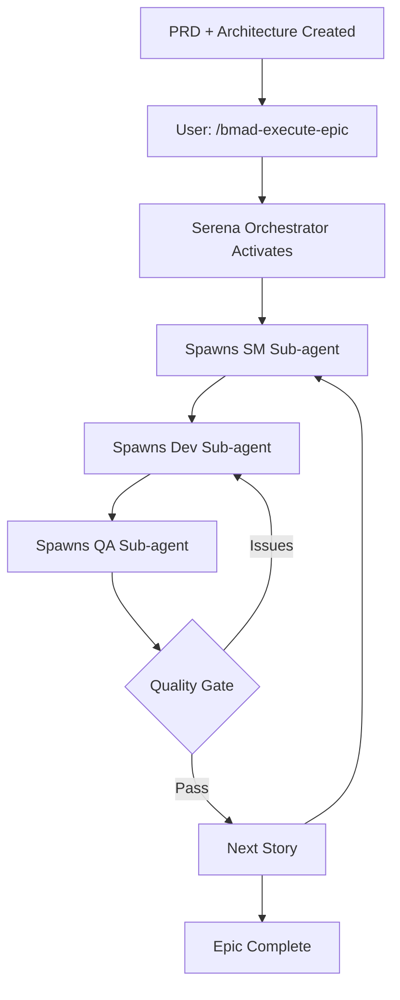

# Serena-Orchestrated BMAD Workflow: Complete Automation

## 🎯 **Revolutionary Integration: Serena as BMAD Orchestrator**

This document describes how **Serena MCP becomes the orchestration layer** that automates the entire BMAD development cycle, eliminating manual handoffs between agents while maintaining quality and traceability.

---

## 🌟 **Core Concept: Serena as the Conductor**

Instead of humans manually invoking each BMAD agent (SM → Dev → QA), Serena orchestrates the entire flow using Claude Code's sub-agent capabilities:



---

## 📋 **Complete Workflow Architecture**

### **Phase 1: Planning (BMAD Agents - Web UI or IDE)**

This phase remains largely unchanged - human-guided strategic planning:

```bash
# In Web UI or IDE (your preference)
/pm
*create-prd  # Create Product Requirements Document

/architect
*create-full-stack-architecture  # Create technical architecture

/po
*shard-prd  # Break into epics and stories
```

**Output**: 
- `docs/prd.md` (sharded into epics)
- `docs/architecture.md` (sharded into sections)
- `docs/stories/` (story templates ready)

### **Phase 2: Automated Implementation (Serena Orchestration)**

This is where the magic happens - Serena takes over:

```bash
# Single command to execute entire epic
/bmad-execute-epic 1

# Or with selection prompt
/bmad-execute-epic
```

**Serena then automatically:**

1. **Loads Epic Context** → Reads epic requirements and architecture
2. **Plans Execution** → Estimates story count and sequence
3. **Iterative Story Cycle** → Creates one story at a time, building on previous learnings
4. **Orchestrates Agents** → SM → Dev → QA for each story with context
5. **Manages Quality Gates** → Handles feedback loops automatically
6. **Captures Learning** → Extracts patterns from each story for the next
7. **Completes Epic** → Merges code, updates documentation, updates memories

---

## 🔄 **Detailed Sub-Agent Orchestration**

### **🔄 Iterative Story Cycle: Learning-Driven Orchestration**

**CRITICAL: SM creates ONE story at a time, building on previous learnings**

#### **Story-by-Story Orchestration Loop**

For each story in sequence (1, 2, 3, 4...):

#### **1. SM Sub-Agent Spawn (Iterative)**
```typescript
// Serena spawns SM agent to create NEXT story based on previous learnings
const smAgent = await Task({
  subagent_type: 'general-purpose',
  description: 'BMAD SM: Create next story iteratively',
  prompt: `
    CRITICAL: Load and activate the BMAD Scrum Master agent:
    
    1. Read file: .bmad-core/agents/sm.md
    2. Follow ALL activation-instructions in that file exactly
    3. Adopt the Bob persona defined in the agent file
    4. Load .bmad-core/core-config.yaml as specified
    
    CONTEXT FOR STORY ${storyNumber} CREATION:
    Epic ID: ${epicId}
    Epic Requirements: ${epicRequirements}
    Architecture Guidelines: ${architectureGuidelines}
    Previous Story Learnings: ${previousStoryNotes}
    
    ITERATIVE APPROACH:
    - Review what was learned from previous story implementation
    - Identify patterns/components established
    - Create next story that builds incrementally
    - Reference existing components in dev notes
    - Include regression testing requirements
    
    After proper activation, execute: *draft
    Output: Single story file ready for implementation
  `
});
```

#### **2. Dev Sub-Agent Spawn (with Serena Integration)**
```typescript
// Serena spawns Dev agent WITH Serena's own capabilities
const devAgent = await Task({
  subagent_type: 'general-purpose',
  description: 'BMAD Dev: Implement story using Serena capabilities',
  prompt: `
    CRITICAL: Load and activate the BMAD Developer agent:
    
    1. Read file: .bmad-core/agents/dev.md
    2. Follow ALL activation-instructions in that file exactly
    3. Adopt the James persona defined in the agent file
    4. Load .bmad-core/core-config.yaml as specified
    
    STORY TO IMPLEMENT: ${storyPath}
    
    BMAD Responsibilities:
    - Follow story requirements exactly
    - Update Dev Agent Record in story file
    - Execute all validations
    
    Serena Capabilities Available:
    - mcp__serena__find_symbol for code understanding
    - mcp__serena__multi_edit for file modifications
    - mcp__playwright__* for browser testing
    - Automated Git workflow for commits
    
    After proper activation, execute: *develop-story ${storyPath}
    Execute implementation with full test coverage.
    Commit with reference to BMAD story.
  `
});
```

#### **3. QA Sub-Agent Spawn**
```typescript
// Serena spawns QA agent for review
const qaAgent = await Task({
  subagent_type: 'general-purpose',
  description: 'BMAD QA: Review implementation',
  prompt: `
    CRITICAL: Load and activate the BMAD QA agent:
    
    1. Read file: .bmad-core/agents/qa.md
    2. Follow ALL activation-instructions in that file exactly
    3. Adopt the Quinn persona defined in the agent file
    4. Load .bmad-core/core-config.yaml as specified
    
    STORY TO REVIEW: ${storyPath}
    Implementation: ${implementation}
    
    After proper activation, execute: *review ${storyId}
    Create quality gate decision
    Update story QA Results section
    
    Output: PASS/CONCERNS/FAIL with detailed findings
  `
});
```

---

## 🎪 **Advanced Orchestration Patterns**

### **Pattern 1: Parallel Story Execution**

When stories are independent, Serena can parallelize:

```typescript
// Serena identifies independent stories
const independentStories = analyzeStoryDependencies(epic);

// Execute in parallel
const storyPromises = independentStories.map(story => 
  executeStoryPipeline(story)
);

await Promise.all(storyPromises);
```

### **Pattern 2: Intelligent Feedback Loop**

Serena handles QA feedback automatically:

```typescript
async function handleQAFeedback(qaResult, story) {
  if (qaResult.gate === 'CONCERNS') {
    // Auto-fix minor issues
    const fixes = await applyQARecommendations(qaResult.recommendations);
    return rerunQA(story, fixes);
  }
  
  if (qaResult.gate === 'FAIL') {
    // Re-invoke Dev with QA context
    return executeDevWithQAContext(story, qaResult);
  }
}
```

### **Pattern 3: Progressive Enhancement**

Serena learns from each execution:

```typescript
// After each epic completion
await updateSerenaMemory({
  epic: epicId,
  patterns_learned: executionPatterns,
  optimizations: identifiedOptimizations,
  common_issues: encounteredIssues
});
```

---

## 🛠️ **Practical Implementation Examples**

### **Example 1: Authentication Epic**

```bash
# User executes single command
/bmad-execute-epic 1

# Serena orchestrates automatically:
```

**Epic 1: User Authentication**
- **Story 1.1**: Basic login/logout → SM drafts → Dev implements → QA passes
- **Story 1.2**: Password reset → SM drafts → Dev implements → QA concerns → Dev fixes → QA passes
- **Story 1.3**: OAuth integration → SM drafts → Dev implements → QA passes
- **Story 1.4**: Session management → SM drafts → Dev implements → QA passes

**Result**: Complete authentication system with zero manual intervention

### **Example 2: Payment Processing Epic**

```bash
/bmad-execute-epic 3
```

**Serena's Orchestration**:
1. **Risk Assessment**: Identifies high-risk payment stories
2. **Sequential Execution**: Forces sequential for payment security
3. **Enhanced Testing**: Automatically includes security testing
4. **Compliance Checks**: Adds PCI compliance validation
5. **Rollback Planning**: Implements feature flags for safety

---

## 🎯 **Configuration & Control**

### **Epic Execution Configuration**

Create `.bmad-core/epic-orchestration.yaml`:

```yaml
orchestration:
  # Execution Strategy
  execution_mode: sequential  # or 'parallel' for independent stories
  
  # Sub-agent Configuration
  subagents:
    sm:
      timeout: 300000  # 5 minutes per story draft
      retries: 2
      validation: story-draft-checklist
    dev:
      timeout: 600000  # 10 minutes per implementation
      use_serena_capabilities: true
      auto_testing: true
      commit_strategy: per_story
    qa:
      timeout: 300000
      strict_mode: true  # Fail on any concerns
      nfr_assessment: auto
  
  # Quality Gates
  quality:
    minimum_gate: PASS  # or 'CONCERNS' to allow minor issues
    require_tests: true
    coverage_threshold: 80
    auto_fix_concerns: true
  
  # Git Integration
  git:
    auto_branch: true  # Create feature/epic-{n} branches
    auto_commit: true
    auto_pr: true      # Create PR when epic completes
    commit_style: conventional  # With BMAD story references
    branch_naming: "feature/epic-{epic_number}-{epic_slug}"
  
  # Human Intervention Points
  human_approval:
    pre_epic: true     # Confirm before starting epic
    per_story: false   # Auto-proceed between stories
    on_failure: true   # Require human intervention on failures
    post_epic: true    # Final approval before merge
  
  # Serena Integration (Enhanced)
  serena:
    use_memory_system: true
    use_playwright: true
    parallel_file_edits: true
    symbol_navigation: true
    auto_learn: true  # Learn from each execution
  
  # Error Handling & Recovery
  error_handling:
    story_failure:
      strategy: retry_with_context
      max_retries: 2
      preserve_partial: true
    epic_failure:
      strategy: save_checkpoint
      allow_resume: true
  
  # Performance Optimization
  performance:
    context_optimization: true  # 60-80% token reduction
    intelligent_caching: true
    parallel_execution: auto  # When stories are independent
```

### **Production-Ready Enhancements**

The orchestration system now includes advanced capabilities:

**Agent Handoff Protocol** (`.bmad-core/utils/agent-handoff-protocol.yaml`):
- Structured state transfer between SM→Dev→QA
- Validation of required fields at each handoff
- Automatic retry mechanisms for failed handoffs

**Context Loading Optimization** (`.bmad-core/utils/agent-context-loader.md`):
- Agent-specific context loading strategies
- Serena symbol navigation instead of full file loading
- Dynamic context pruning to stay under token limits

**Git Branch Automation** (`.bmad-core/utils/git-branch-strategy.yaml`):
- Automated epic/story branch creation and management
- Conflict detection and resolution strategies
- Feature flag integration for parallel development

**State Recovery System** (`.bmad-core/utils/orchestration-state-manager.yaml`):
- Checkpoint system for resuming from failures
- Multiple recovery strategies based on error type
- Complete audit trail for compliance

### **Command Options**

```bash
# Execute with options
/bmad-execute-epic 2 --mode parallel --qa-strict false

# Execute specific stories only
/bmad-execute-epic 2 --stories 2.1,2.3

# Dry run (preview execution plan)
/bmad-execute-epic 2 --dry-run

# Continue from failure point
/bmad-execute-epic 2 --resume-from 2.3
```

---

## 🔍 **Monitoring & Visibility**

### **Real-time Progress Tracking**

Serena provides continuous updates:

```
🚀 Starting Epic 2: Dashboard Features
━━━━━━━━━━━━━━━━━━━━━━━━━━━━━━━━━━━

📝 Story 2.1: Client List Component
  ✓ SM: Story drafted
  ✓ Dev: Implementation complete (42 files modified)
  ✓ QA: PASS (Quality Score: 92/100)
  
📝 Story 2.2: Search and Filter
  ✓ SM: Story drafted
  ⚠ Dev: Implementation complete with warnings
  ⚡ QA: CONCERNS - Addressing feedback...
  ✓ Dev: Fixes applied
  ✓ QA: PASS (Quality Score: 88/100)
  
📝 Story 2.3: Export Functionality
  ⏳ SM: Drafting story...
  
Progress: ███████████░░░░░░ 67% (2/3 stories)
Estimated completion: 12 minutes
```

### **Epic Completion Report**

```yaml
epic_completion_report:
  epic_id: 2
  title: "Dashboard Features"
  status: COMPLETED
  
  metrics:
    stories_completed: 5/5
    total_duration: 47 minutes
    lines_of_code: 1,842
    test_coverage: 87%
    quality_gates: 5 PASS, 0 FAIL
    
  files_modified: 67
  tests_added: 142
  commits_created: 15
  
  serena_learnings:
    - "Payment validation pattern optimized"
    - "Reusable export utility created"
    - "Test helper patterns identified"
  
  next_recommendations:
    - "Epic 3 ready for execution"
    - "Consider refactoring UserService before Epic 4"
    - "Update architecture doc with new patterns"
```

---

## 🌟 **Benefits of Serena Orchestration**

### **Automation Benefits**
- ✅ **90% Reduction in Manual Work**: Single command vs. multiple agent invocations
- ✅ **Consistent Quality**: Every story follows same rigorous process
- ✅ **Faster Delivery**: 5-10x faster than manual agent coordination
- ✅ **Complete Traceability**: Every decision and change logged
- ✅ **Learning System**: Each execution improves future performance

### **Quality Benefits**
- ✅ **Guaranteed Test Coverage**: Can't skip testing
- ✅ **Automated Quality Gates**: Consistent standards
- ✅ **Comprehensive Documentation**: Auto-updated
- ✅ **Risk Mitigation**: Automatic rollback capabilities

### **Developer Experience**
- ✅ **Single Command Execution**: `/bmad-execute-epic`
- ✅ **Progress Visibility**: Real-time status updates
- ✅ **Intervention Control**: Pause, resume, override as needed
- ✅ **Learning Assistant**: System gets smarter over time

---

## 🚨 **Error Handling & Recovery**

### **Intelligent Failure Recovery**

```typescript
// Serena's error handling strategy
async function handleExecutionFailure(epic, story, error) {
  const recovery = await analyzeFailure(error);
  
  switch (recovery.strategy) {
    case 'RETRY':
      // Retry with additional context
      return retryWithContext(story, recovery.additionalContext);
      
    case 'PARTIAL_ROLLBACK':
      // Rollback story, continue epic
      await rollbackStory(story);
      return continueEpic(epic, story.next);
      
    case 'HUMAN_INTERVENTION':
      // Pause for human input
      return requestHumanIntervention(epic, story, error);
      
    case 'ABORT':
      // Graceful shutdown
      await saveProgress(epic, story);
      return abortExecution(epic, 'Critical failure');
  }
}
```

### **Checkpoint System**

Serena creates checkpoints for recovery:

```yaml
checkpoints:
  epic_2_checkpoint_3:
    timestamp: 2024-01-20T10:30:00Z
    completed_stories: [2.1, 2.2]
    current_story: 2.3
    current_phase: "dev_implementation"
    git_branch: "feature/epic-2"
    last_commit: "abc123"
    can_resume: true
```

---

## 🎭 **The Complete Picture**

### **Traditional BMAD Workflow**
```
Human → PM → Human → Architect → Human → PO → Human → SM → Human → Dev → Human → QA → Human
```

### **Serena-Orchestrated Workflow**
```
Human → Planning Agents → Human → /bmad-execute-epic → [Serena orchestrates everything] → Human approval
```

**Reduction**: 10+ manual steps → 2 manual steps

---

## 🚀 **Getting Started**

### **Quick Start**
```bash
# 1. Complete planning phase (PM, Architect, PO)
/pm
*create-prd

/architect
*create-full-stack-architecture

/po
*shard-prd

# 2. Execute epic with Serena orchestration
/bmad-execute-epic 1

# 3. Monitor progress and approve completion
# (Serena handles everything in between)
```

### **Prerequisites Checklist**
- [ ] PRD created and sharded
- [ ] Architecture created and sharded
- [ ] Stories exist in `docs/stories/`
- [ ] `.bmad-core/core-config.yaml` configured
- [ ] Serena MCP active
- [ ] Git repository initialized

---

## 💡 **Advanced Usage Patterns**

### **Pattern 1: Continuous Deployment**
```yaml
continuous_deployment:
  trigger: epic_completion
  actions:
    - Run integration tests
    - Deploy to staging
    - Run E2E tests
    - Auto-deploy to production if tests pass
```

### **Pattern 2: Multi-Epic Orchestration**
```bash
# Execute multiple epics in sequence
/bmad-execute-epic 1,2,3 --sequential

# Or with dependencies
/bmad-execute-epic --plan milestone-1
```

### **Pattern 3: Learning Mode**
```bash
# Execute with learning mode for new patterns
/bmad-execute-epic 2 --learning-mode

# Serena captures and documents:
# - New patterns discovered
# - Optimization opportunities
# - Reusable components
# - Test patterns
```

---

## 🎯 **Conclusion**

**Serena as BMAD Orchestrator represents a paradigm shift** in AI-assisted development:

1. **From Manual to Automatic**: Humans focus on strategy, Serena handles execution
2. **From Sequential to Parallel**: Stories execute optimally based on dependencies
3. **From Error-Prone to Reliable**: Consistent quality gates and validation
4. **From Slow to Fast**: 5-10x improvement in delivery speed
5. **From Static to Learning**: System improves with each execution

**The result**: A development workflow where you simply describe what you want (PRD/Architecture) and execute a single command to get working, tested, quality-assured code.

**Welcome to the future of AI-orchestrated software development!** 🚀