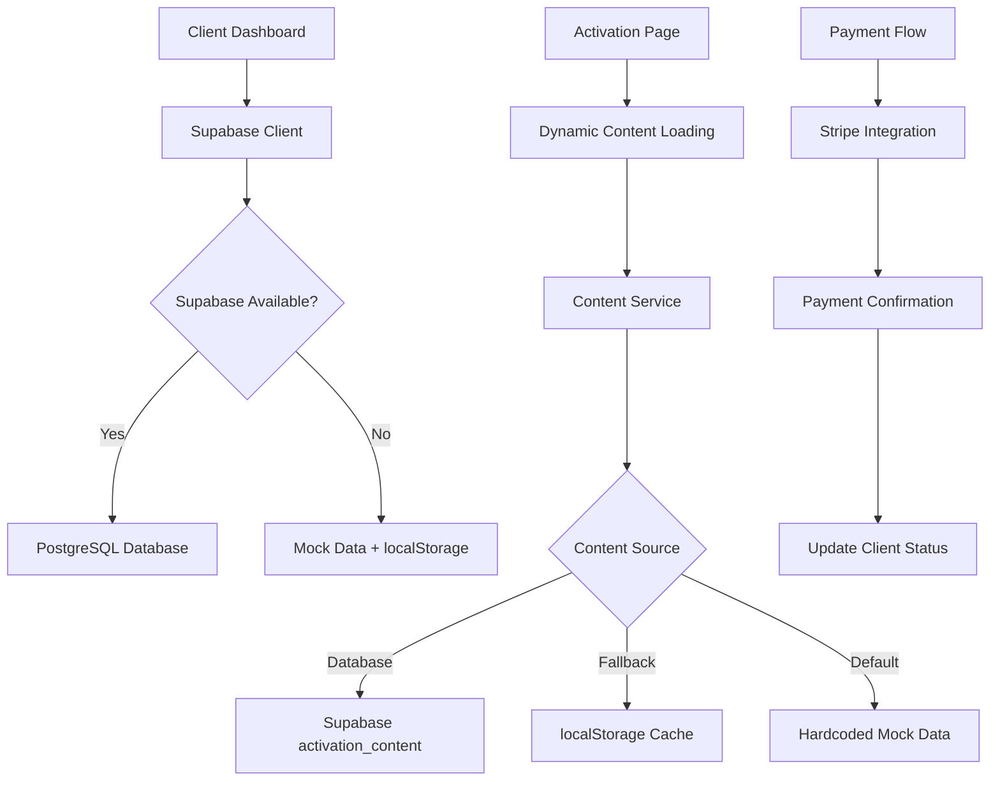

# 🏗️ Template Genius Activation - Brownfield Architecture Document

**Document Version:** 2.0  
**Date:** August 28, 2025  
**Architect:** Winston (BMAD Architect Agent)  
**Project:** Template Genius Priority Access Dashboard

---

## Executive Summary

The **Template Genius Activation** system is a Next.js 15-based client activation platform designed to support Genius recruitment agency's new $500 activation fee business model. This brownfield architecture document provides comprehensive guidance for understanding, maintaining, and extending the existing system.

### Key Business Context
- **Primary Goal:** Transform from $0 activation to $500 activation fee model
- **Target:** $10K monthly revenue from activation fees
- **Timeline:** 90-day proof of concept
- **Current Status:** Mock implementation ready for Supabase integration

---

## 1. System Overview & Business Context

### 1.1 Business Model Transformation
**From:** Free recruitment service → **To:** $500 activation fee with A/B service options
- **Option A:** Traditional placement (25% fee, activation credited)
- **Option B:** Monthly retainer ($1,200/month, activation credited)

### 1.2 Core User Journeys
1. **Dashboard Management:** Admin creates clients, edits content, views statistics
2. **Client Activation:** Client receives email → visits activation page → pays fee → confirmed
3. **Content Management:** Real-time editing of activation page content with live preview

---

## 2. Current Architecture Analysis

### 2.1 Technology Stack Assessment

#### ✅ **Strengths**
```yaml
Frontend Framework: Next.js 15.2.4 (latest)
  - App Router implementation
  - React 19 with concurrent features
  - TypeScript strict mode enabled
  
UI/UX Stack: Comprehensive & Modern
  - 40+ Shadcn/ui components
  - Radix UI primitives (accessibility-first)
  - Tailwind CSS 4.1.9
  - CVA for component variants

Development Experience: Excellent
  - Docker containerization (dev & prod)
  - Hot reload with volume mounting
  - pnpm package management
  - ESLint + Prettier configured
```

#### ⚠️ **Technical Debt & Constraints**
```yaml
Build Configuration Issues:
  - ignoreBuildErrors: true (Next.js)
  - ignoreDuringBuilds: true (TypeScript)
  - unoptimized images
  - No environment validation

Data Layer Concerns:
  - Mock data fallback throughout app
  - No data migration strategy
  - Incomplete Supabase integration
  - localStorage as backup (unreliable)

Security & Production Gaps:
  - Placeholder Stripe URLs
  - Open RLS policies ("allow all")
  - No input validation schemas
  - Missing error boundaries
```

### 2.2 Architecture Patterns

#### **Current Pattern: Hybrid Mock + Database**
```typescript
// Pattern used throughout lib/supabase.ts
export const clientService = {
  async getAll(): Promise<Client[]> {
    if (!useSupabase) {
      return [...mockClients]; // Fallback
    }
    
    try {
      const { data, error } = await supabase.from("clients").select("*");
      if (error) throw error;
      return data || [];
    } catch (error) {
      console.warn("Supabase query failed, using mock data:", error);
      return [...mockClients]; // Graceful degradation
    }
  }
}
```

**Analysis:** This pattern provides excellent development experience but creates production risks.

---

## 3. Component Architecture Deep Dive

### 3.1 Application Structure
```
app/
├── layout.tsx          # Root layout with theme providers
├── page.tsx           # Redirects to /dashboard
├── dashboard/
│   └── page.tsx       # Main admin interface (924 lines)
├── activate/
│   ├── [token]/page.tsx  # Client activation flow (511 lines)
│   └── preview/page.tsx  # Content preview
├── agreement/page.tsx    # Terms and conditions
├── confirmation/page.tsx # Post-activation success
└── processing/page.tsx   # Payment processing state
```

### 3.2 Component Complexity Analysis

#### **High Complexity: Dashboard Component**
```yaml
Location: app/dashboard/page.tsx
Size: 924 lines (⚠️ Exceeds recommended 400 lines)
Responsibilities:
  - Client CRUD operations
  - Content management system
  - Statistics dashboard
  - Live preview functionality
  - Tab-based UI navigation

Refactoring Recommendation:
  - Split into: ClientManager, ContentEditor, StatsPanel, PreviewPane
  - Extract custom hooks for state management
  - Create dedicated services layer
```

#### **Medium Complexity: Activation Flow**
```yaml
Location: app/activate/[token]/page.tsx  
Size: 511 lines
Responsibilities:
  - Dynamic content rendering
  - Client data fetching
  - Payment option selection
  - Form validation & submission

Optimization Opportunities:
  - Extract payment logic to separate hook
  - Create reusable PaymentOption component
  - Implement proper form validation with Zod
```

### 3.3 State Management Assessment

#### **Current Approach: Local State**
```typescript
// Pattern used throughout the application
const [clients, setClients] = useState<Client[]>([]);
const [content, setContent] = useState(defaultContent);
const [isLoading, setIsLoading] = useState(true);

// Data synchronization via useEffect
useEffect(() => {
  loadClients().then(setClients);
  loadContent().then(setContent);
}, []);
```

**Assessment:** Adequate for current scope, but will need optimization as the system scales.

---

## 4. Data Architecture & Storage Strategy

### 4.1 Database Schema Analysis

#### **Current Schema (Supabase PostgreSQL)**
```sql
-- Core Tables
clients (
  id BIGSERIAL PRIMARY KEY,
  company TEXT NOT NULL,
  contact TEXT NOT NULL,
  email TEXT NOT NULL UNIQUE,
  position TEXT NOT NULL,
  salary TEXT NOT NULL,
  status TEXT CHECK (status IN ('pending', 'activated')),
  created_at TIMESTAMPTZ DEFAULT NOW(),
  activated_at TIMESTAMPTZ,
  logo TEXT
)

activation_content (
  id BIGSERIAL PRIMARY KEY,
  title TEXT NOT NULL,
  subtitle TEXT NOT NULL,
  benefits JSONB NOT NULL,
  payment_options JSONB NOT NULL,
  investment_details JSONB NOT NULL,
  updated_at TIMESTAMPTZ DEFAULT NOW()
)
```

#### **Missing Tables (For Full PRD Implementation)**
```sql
-- Recommended additions based on PRD requirements
payments (
  id BIGSERIAL PRIMARY KEY,
  client_id BIGINT REFERENCES clients(id),
  stripe_payment_id TEXT UNIQUE,
  amount INTEGER NOT NULL, -- cents
  option_selected TEXT CHECK (option_selected IN ('A', 'B')),
  status TEXT CHECK (status IN ('pending', 'completed', 'failed')),
  created_at TIMESTAMPTZ DEFAULT NOW()
)

audit_log (
  id BIGSERIAL PRIMARY KEY,
  table_name TEXT NOT NULL,
  record_id BIGINT NOT NULL,
  action TEXT NOT NULL,
  changes JSONB,
  user_id TEXT,
  created_at TIMESTAMPTZ DEFAULT NOW()
)
```

### 4.2 Data Flow Architecture



---

## 5. Integration Architecture

### 5.1 Current Integrations

#### **Supabase Integration**
```typescript
// Current implementation: lib/supabase.ts
const supabaseUrl = process.env.NEXT_PUBLIC_SUPABASE_URL;
const supabaseKey = process.env.NEXT_PUBLIC_SUPABASE_ANON_KEY;

// Graceful fallback pattern
let supabase: any = null;
let useSupabase = false;

if (supabaseUrl && supabaseKey) {
  try {
    supabase = createClient(supabaseUrl, supabaseKey);
    useSupabase = true;
  } catch (error) {
    console.warn("Supabase client creation failed, using mock data:", error);
    useSupabase = false;
  }
}
```

#### **Payment Integration (Placeholder)**
```typescript
// Current implementation: Placeholder URLs
const paymentUrls = {
  A: "https://buy.stripe.com/test_activation_option_a",
  B: "https://buy.stripe.com/test_activation_option_b",
};

// Simulated flow (needs real Stripe integration)
setTimeout(() => {
  router.push("/processing");
}, 500);
```

### 5.2 Required Integrations (Per PRD)

#### **Stripe Payment Processing**
```yaml
Requirements:
  - Real payment link creation
  - Webhook handling for payment confirmation
  - Automatic client status updates
  - Refund processing capability
  - Payment option differentiation (A vs B)

Implementation Priority: HIGH
Timeline: Week 1 of PRD implementation
```

#### **Email Service Integration**
```yaml
Requirements:
  - Activation link generation and sending
  - Payment confirmation emails
  - Dream Candidate Profile delivery
  - Progress updates to clients

Recommended Service: SendGrid or AWS SES
Implementation Priority: MEDIUM
Timeline: Week 2 of PRD implementation
```

---

## 6. Security Architecture Assessment

### 6.1 Current Security Posture

#### **⚠️ Security Gaps**
```yaml
Authentication:
  - No user authentication implemented
  - Dashboard is publicly accessible
  - Client data is unprotected

Authorization:
  - RLS policies are wide open ("allow all")
  - No role-based access control
  - Admin functions accessible to anyone

Data Protection:
  - No input validation schemas
  - XSS vulnerabilities in content rendering
  - No rate limiting on API endpoints

Payment Security:
  - Placeholder payment URLs
  - No webhook signature verification
  - No payment state validation
```

### 6.2 Recommended Security Implementation

#### **Phase 1: Immediate Security (Week 1)**
```typescript
// 1. Input validation with Zod
import { z } from 'zod';

const ClientSchema = z.object({
  company: z.string().min(1).max(255),
  contact: z.string().min(1).max(255),
  email: z.string().email(),
  position: z.string().min(1).max(255),
  salary: z.string().min(1).max(100),
});

// 2. Admin authentication
const AdminAuthSchema = z.object({
  password: z.string().min(8),
  adminKey: z.string().min(16),
});
```

#### **Phase 2: Production Security (Week 2-3)**
```sql
-- Update RLS policies
DROP POLICY "Allow all operations on clients" ON clients;
DROP POLICY "Allow all operations on activation_content" ON activation_content;

-- Create proper RLS policies
CREATE POLICY "Admin access only" ON clients
  FOR ALL USING (auth.role() = 'admin');

CREATE POLICY "Read activation content" ON activation_content
  FOR SELECT USING (true);

CREATE POLICY "Admin update activation content" ON activation_content
  FOR INSERT, UPDATE USING (auth.role() = 'admin');
```

---

## 7. Performance Architecture

### 7.1 Current Performance Characteristics

#### **Strengths**
- **React 19 Concurrent Features:** Automatic optimizations for rendering
- **Next.js 15 App Router:** Optimized bundling and routing
- **Component Architecture:** Proper component composition with Shadcn/ui
- **Database Indexing:** Proper indexes on clients table

#### **Performance Concerns**
```yaml
Large Component Files:
  - Dashboard: 924 lines (bundle size impact)
  - Activation: 511 lines (initial render delay)

Client-Side Data Loading:
  - All components use "use client"
  - No server-side rendering benefits
  - Waterfall loading patterns

Image Optimization Disabled:
  - unoptimized: true in next.config.mjs
  - External image URLs without optimization
  - No lazy loading implementation
```

### 7.2 Performance Optimization Roadmap

#### **Phase 1: Quick Wins (Week 1)**
```typescript
// 1. Enable image optimization
// next.config.mjs
const nextConfig = {
  images: {
    unoptimized: false, // Enable optimization
    domains: ['hebbkx1anhila5yf.public.blob.vercel-storage.com'],
    formats: ['image/webp', 'image/avif'],
  },
};

// 2. Implement proper loading states
const ClientList = () => {
  const { data: clients, isLoading, error } = useSWR('/api/clients', fetcher);
  
  if (isLoading) return <ClientListSkeleton />;
  if (error) return <ErrorState error={error} />;
  
  return <ClientListView clients={clients} />;
};
```

#### **Phase 2: Architecture Improvements (Week 2-4)**
```typescript
// 1. Split large components
// components/dashboard/ClientManager.tsx
// components/dashboard/ContentEditor.tsx
// components/dashboard/StatsPanel.tsx

// 2. Implement server components where possible
// app/dashboard/loading.tsx
export default function Loading() {
  return <DashboardSkeleton />;
}

// app/dashboard/error.tsx
export default function Error({ error, reset }) {
  return <ErrorBoundary error={error} reset={reset} />;
}
```

---

## 8. Scalability Architecture

### 8.1 Current Scalability Assessment

#### **Scale Limitations**
```yaml
Client-Side Processing:
  - All data processing happens in browser
  - No server-side caching
  - LocalStorage backup unreliable

Single Database Connection:
  - All requests use single Supabase connection
  - No connection pooling
  - No read replicas

Monolithic Component Structure:
  - Large components difficult to scale
  - State management becomes complex
  - Testing becomes challenging
```

### 8.2 Scalability Roadmap

#### **Phase 1: Data Layer Scaling**
```typescript
// 1. Implement proper data fetching with SWR
import useSWR from 'swr';

const useClients = () => {
  const { data, error, mutate } = useSWR('/api/clients', fetcher, {
    refreshInterval: 30000, // 30 seconds
    revalidateOnFocus: false,
    dedupingInterval: 5000,
  });
  
  return {
    clients: data,
    isLoading: !error && !data,
    error,
    mutate,
  };
};

// 2. API route caching
// app/api/clients/route.ts
import { NextRequest, NextResponse } from 'next/server';
import { unstable_cache } from 'next/cache';

const getCachedClients = unstable_cache(
  async () => clientService.getAll(),
  ['clients'],
  { revalidate: 300 } // 5 minutes
);
```

#### **Phase 2: Component Architecture Scaling**
```typescript
// 1. Component composition pattern
// components/dashboard/Dashboard.tsx
export default function Dashboard() {
  return (
    <DashboardLayout>
      <Suspense fallback={<ClientsSkeleton />}>
        <ClientManager />
      </Suspense>
      <Suspense fallback={<ContentSkeleton />}>
        <ContentEditor />
      </Suspense>
      <Suspense fallback={<StatsSkeleton />}>
        <StatsPanel />
      </Suspense>
    </DashboardLayout>
  );
}

// 2. Custom hooks for business logic
export const useClientOperations = () => {
  const { clients, mutate } = useClients();
  
  const createClient = async (clientData: CreateClientData) => {
    const newClient = await clientService.create(clientData);
    mutate([...clients, newClient], false);
    return newClient;
  };
  
  const updateClient = async (id: number, updates: UpdateClientData) => {
    const updatedClient = await clientService.update(id, updates);
    mutate(clients.map(c => c.id === id ? updatedClient : c), false);
    return updatedClient;
  };
  
  return { createClient, updateClient };
};
```

---

## 9. Development & Deployment Architecture

### 9.1 Current DevOps Setup

#### **✅ Docker Implementation**
```yaml
Development Environment:
  - Docker Compose setup
  - Volume mounting for hot reload
  - Node.js 22 Alpine base image
  - Port 3000 exposed and mapped

Build Configuration:
  - Multi-stage Dockerfile
  - Development and production targets
  - pnpm for package management
  - Optimized for Vercel deployment
```

#### **⚠️ Missing DevOps Components**
```yaml
Testing Infrastructure:
  - No test runner configured
  - No E2E testing setup
  - No component testing
  - No API testing

CI/CD Pipeline:
  - No GitHub Actions
  - No automated testing
  - No staging environment
  - No deployment automation

Monitoring & Observability:
  - No error tracking
  - No performance monitoring
  - No user analytics
  - No health checks
```

### 9.2 Recommended DevOps Enhancement

#### **Phase 1: Testing Infrastructure**
```yaml
# .github/workflows/test.yml
name: Test & Build
on: [push, pull_request]
jobs:
  test:
    runs-on: ubuntu-latest
    services:
      postgres:
        image: postgres:15
        env:
          POSTGRES_PASSWORD: postgres
        options: >-
          --health-cmd pg_isready
          --health-interval 10s
          --health-timeout 5s
          --health-retries 5
    steps:
      - uses: actions/checkout@v3
      - uses: pnpm/action-setup@v2
        with:
          version: latest
      - run: pnpm install
      - run: pnpm test
      - run: pnpm build
```

#### **Phase 2: Production Deployment**
```typescript
// monitoring/health.ts
export async function GET() {
  const healthChecks = {
    database: await checkDatabase(),
    redis: await checkRedis(),
    stripe: await checkStripe(),
    timestamp: new Date().toISOString(),
  };
  
  const allHealthy = Object.values(healthChecks).every(
    check => typeof check === 'object' ? check.status === 'healthy' : check
  );
  
  return NextResponse.json(healthChecks, {
    status: allHealthy ? 200 : 503,
  });
}
```

---

## 10. Migration & Enhancement Strategy

### 10.1 Critical Path for PRD Implementation

#### **Week 1: Foundation (Days 1-7)**
```yaml
Priority 1 - Payment Integration:
  - [ ] Replace mock Stripe URLs with real payment links
  - [ ] Implement webhook handlers for payment confirmation
  - [ ] Add payment status tracking to clients table
  - [ ] Test payment flow end-to-end

Priority 2 - Security Hardening:
  - [ ] Add admin authentication
  - [ ] Implement proper RLS policies
  - [ ] Add input validation with Zod
  - [ ] Enable CSRF protection
```

#### **Week 2-4: Business Logic (Days 8-28)**
```yaml
Priority 1 - Discovery Call Integration:
  - [ ] Create slide presentation management
  - [ ] Add script content management
  - [ ] Implement A/B option tracking
  - [ ] Add client interaction logging

Priority 2 - Email Automation:
  - [ ] Integrate with email service (SendGrid)
  - [ ] Create activation email templates
  - [ ] Implement Dream Candidate Profile delivery
  - [ ] Add progress update automation
```

#### **Week 5-8: Optimization (Days 29-56)**
```yaml
Priority 1 - Performance & UX:
  - [ ] Split large components
  - [ ] Implement proper loading states
  - [ ] Add error boundaries
  - [ ] Optimize bundle size

Priority 2 - Analytics & Monitoring:
  - [ ] Add conversion tracking
  - [ ] Implement user behavior analytics
  - [ ] Create business metrics dashboard
  - [ ] Add error monitoring (Sentry)
```

### 10.2 Component Refactoring Strategy

#### **Large Component Breakdown**
```typescript
// Current: app/dashboard/page.tsx (924 lines)
// Target: Multiple focused components

// 1. Extract state management
// hooks/useClients.ts
// hooks/useContent.ts
// hooks/useStats.ts

// 2. Extract UI components
// components/dashboard/ClientTable.tsx
// components/dashboard/ContentEditor.tsx
// components/dashboard/StatsCards.tsx
// components/dashboard/PreviewPanel.tsx

// 3. Create composed dashboard
// app/dashboard/page.tsx (< 100 lines)
export default function DashboardPage() {
  return (
    <DashboardLayout>
      <DashboardTabs>
        <ClientsTab />
        <ContentTab />
        <StatsTab />
      </DashboardTabs>
    </DashboardLayout>
  );
}
```

---

## 11. Technical Recommendations

### 11.1 Immediate Actions (Next 48 Hours)

#### **Critical Fixes**
```bash
# 1. Enable proper TypeScript checking
# next.config.mjs
const nextConfig = {
  typescript: {
    ignoreBuildErrors: false, // Enable type checking
  },
  eslint: {
    ignoreDuringBuilds: false, // Enable lint checking
  },
};

# 2. Add environment validation
# lib/env.ts
import { z } from 'zod';

const envSchema = z.object({
  NEXT_PUBLIC_SUPABASE_URL: z.string().url(),
  NEXT_PUBLIC_SUPABASE_ANON_KEY: z.string().min(1),
  SUPABASE_SERVICE_ROLE_KEY: z.string().min(1),
  STRIPE_SECRET_KEY: z.string().min(1),
  STRIPE_WEBHOOK_SECRET: z.string().min(1),
});

export const env = envSchema.parse(process.env);
```

#### **Production Readiness Checklist**
```yaml
Security:
  - [ ] Remove open RLS policies
  - [ ] Add admin authentication
  - [ ] Validate all inputs
  - [ ] Enable HTTPS redirects

Performance:
  - [ ] Enable image optimization
  - [ ] Add proper caching headers
  - [ ] Implement error boundaries
  - [ ] Add loading states

Monitoring:
  - [ ] Add health check endpoint
  - [ ] Implement error tracking
  - [ ] Add performance monitoring
  - [ ] Create uptime alerts
```

### 11.2 Architecture Evolution Path

#### **Phase 1: Stabilization (Month 1)**
- Fix security vulnerabilities
- Complete Stripe integration
- Add proper error handling
- Implement monitoring

#### **Phase 2: Enhancement (Month 2-3)**
- Refactor large components
- Add comprehensive testing
- Implement email automation
- Create analytics dashboard

#### **Phase 3: Scaling (Month 4+)**
- Add multi-tenancy support
- Implement advanced caching
- Create mobile applications
- Add AI-powered features

---

## 12. Conclusion & Next Steps

### 12.1 System Strengths to Preserve
- **Modern Tech Stack:** Next.js 15 + React 19 + TypeScript foundation
- **Comprehensive UI Library:** Shadcn/ui + Radix primitives
- **Docker Development:** Excellent developer experience
- **Graceful Fallbacks:** Mock data system prevents total failures

### 12.2 Critical Improvements Required
- **Security Implementation:** Currently wide open, needs immediate attention
- **Production Integration:** Stripe, email, and monitoring systems
- **Component Architecture:** Break down monolithic components
- **Data Validation:** Implement comprehensive input validation

### 12.3 Success Metrics
```yaml
Technical KPIs:
  - Build time < 30 seconds
  - Test coverage > 80%
  - Page load time < 3 seconds
  - Error rate < 0.1%

Business KPIs (from PRD):
  - 30%+ activation rate
  - $10K monthly activation revenue
  - <5% refund rate
  - <48 hour conversion time
```

---

**Document Generated By:** Winston (BMAD Architect Agent)  
**Project:** Template Genius Activation  
**Status:** Architecture Analysis Complete ✅