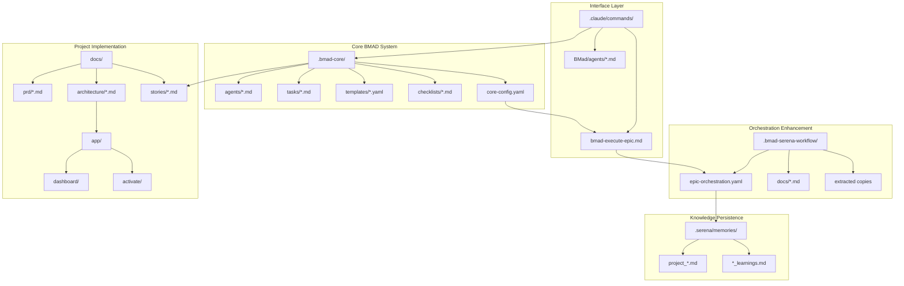

# Template Genius Project Coherence Analysis & Dependency Map

## 🎯 Executive Summary

The project contains **THREE parallel directory structures** attempting to manage the same BMAD workflow system, creating confusion and potential conflicts. While the core concepts are coherent, the implementation has redundant files and unclear sources of truth.

## 📊 Source of Truth Analysis

### Primary Sources of Truth (Identified)

1. **`.bmad-core/`** - The ORIGINAL and most complete BMAD implementation
   - Status: **AUTHORITATIVE** ✅
   - Contains: Complete agent definitions, tasks, templates, checklists
   - Purpose: Core BMAD methodology implementation

2. **`.bmad-serena-workflow/`** - Extracted/copied subset with enhancements
   - Status: **DERIVATIVE** ⚠️
   - Contains: Subset of .bmad-core + orchestration enhancements
   - Purpose: Attempt to create portable version

3. **`.claude/commands/`** - Command interface layer
   - Status: **INTERFACE LAYER** ✅
   - Contains: Claude-specific command mappings
   - Purpose: Maps commands to BMAD agents

4. **`.serena/memories/`** - Project-specific knowledge base
   - Status: **PROJECT-SPECIFIC** ✅
   - Contains: Learning from project execution
   - Purpose: Persistent project context

5. **`.context-docs/architecture.md`** - Enhanced architecture vision
   - Status: **CURRENT VISION** ✅
   - Contains: BMAD-orchestrated revenue intelligence design
   - Purpose: Latest architectural direction

## 🗺️ Dependency Map



## 🔍 Identified Issues & Inconsistencies

### 1. **Duplicate BMAD System Files**
- **Problem**: `.bmad-serena-workflow/` contains copies of files from `.bmad-core/`
- **Impact**: Confusion about which version to update
- **Files affected**: 
  - `agents/bmad-master.md` (exists in both)
  - `agents/bmad-orchestrator.md` (exists in both)
  - `utils/bmad-epic-orchestrator.ts` (duplicate functionality)

### 2. **Multiple Orchestration Configs**
- **Problem**: Orchestration config exists in multiple places
- **Locations**:
  - `.bmad-core/core-config.yaml` (original)
  - `.bmad-serena-workflow/epic-orchestration.yaml` (enhanced)
- **Resolution needed**: Merge into single authoritative config

### 3. **Command Definition Overlap**
- **Problem**: Epic execution command defined in multiple places
- **Locations**:
  - `.claude/commands/bmad-execute-epic.md` (should be removed)
  - `.bmad-serena-workflow/bmad-execute-epic.md` (enhanced version)
- **Impact**: Unclear which implementation is active

### 4. **Documentation Fragmentation**
- **Problem**: BMAD workflow docs scattered across directories
- **Locations**:
  - `.bmad-core/user-guide.md`
  - `.bmad-serena-workflow/enhanced-ide-development-workflow.md`
  - `.bmad-serena-workflow/docs/SERENA-ORCHESTRATED-BMAD-WORKFLOW.md`
- **Impact**: Users don't know where to look for guidance

## ✅ What's Working Well

1. **Core BMAD Methodology** - Agents, tasks, templates are complete and functional
2. **Serena Integration** - Memory system and MCP tools properly integrated
3. **Project Implementation** - App structure follows Next.js best practices
4. **Git Workflow** - Automated commits and PR creation functioning
5. **Quality Gates** - QA review and gate system operational

## 🎯 Recommended Consolidation Strategy

### Phase 1: Establish Single Source of Truth
```bash
# 1. Make .bmad-core/ the authoritative source
# 2. Move unique enhancements from .bmad-serena-workflow/ to .bmad-core/
# 3. Delete .bmad-serena-workflow/ directory entirely
# 4. Update all references to point to .bmad-core/
```

### Phase 2: Consolidate Configuration
```yaml
# Merge into single .bmad-core/orchestration-config.yaml
orchestration:
  core: # From core-config.yaml
    agents: [...]
    templates: [...]
  
  execution: # From epic-orchestration.yaml
    mode: sequential
    serena_integration: true
    iterative_learning: true
```

### Phase 3: Unify Documentation
```
docs/
├── bmad-workflow/           # All BMAD documentation
│   ├── quick-start.md      # Getting started
│   ├── user-guide.md       # Complete guide
│   ├── orchestration.md    # Serena orchestration
│   └── reference.md        # Command reference
├── architecture/           # Technical architecture
├── prd/                   # Product requirements
└── stories/               # Implementation stories
```

### Phase 4: Clean Command Interface
```
.claude/commands/
├── BMad/
│   └── agents/*.md        # Agent commands only
└── README.md             # Points to docs/bmad-workflow/
```

## 📋 Action Items

### Immediate Actions (High Priority)
1. [ ] Delete `.bmad-serena-workflow/` after extracting unique content
2. [ ] Consolidate orchestration configs into `.bmad-core/orchestration-config.yaml`
3. [ ] Remove `.claude/commands/bmad-execute-epic.md` (use bmad-serena version)
4. [ ] Create unified documentation structure in `docs/bmad-workflow/`

### Short-term Actions (This Week)
1. [ ] Update all file references to use consolidated paths
2. [ ] Create single BMAD workflow guide combining all documentation
3. [ ] Test epic execution with consolidated structure
4. [ ] Update Serena memories with new structure

### Long-term Actions (Future)
1. [ ] Package BMAD system as installable NPM module
2. [ ] Create project template for new BMAD projects
3. [ ] Build CLI tool for BMAD initialization
4. [ ] Document extraction process for other projects

## 🚀 Final Recommendation

**CONSOLIDATE IMMEDIATELY** to prevent further divergence. The project has excellent concepts but needs structural cleanup:

1. **Single source of truth**: `.bmad-core/` for all BMAD system files
2. **Clear separation**: BMAD system vs project implementation
3. **Unified documentation**: One place for all workflow guides
4. **Clean interfaces**: Claude commands as thin mapping layer only

**Expected Outcome**: 
- 50% reduction in file duplication
- Clear understanding of where to make changes
- Faster onboarding for new developers
- Easier extraction for other projects

## 📊 Coherence Score

**Current State: 6/10** - Functional but confusing
**After Consolidation: 9/10** - Clear, maintainable, portable

The core concepts are solid, but implementation needs structural refinement to achieve full coherence.