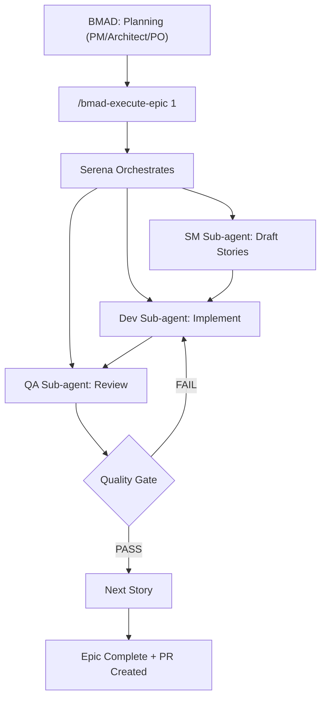
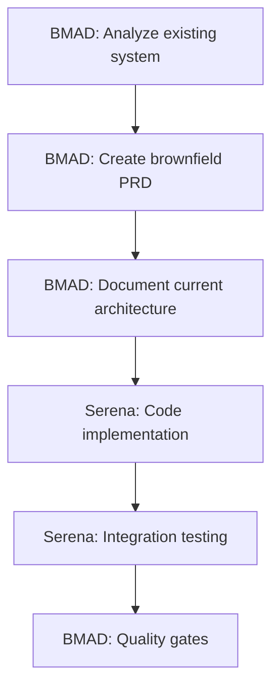

# Unified Serena + BMAD Workflow Guide

## 🎯 Overview: Revolutionary AI-Orchestrated Development

This project leverages **Serena-orchestrated BMAD workflow** - a groundbreaking approach where:
- **BMAD Method**: Provides structured planning methodology with specialized AI agents
- **Serena MCP**: Orchestrates the entire development cycle automatically
- **Single Command Execution**: `/bmad-execute-epic` replaces dozens of manual steps

**🚀 NEW CAPABILITY**: Serena can now orchestrate BMAD's SM → Dev → QA workflow automatically, eliminating manual handoffs between agents!

---

## 🌊 Workflow Selection Guide

### Use BMAD Method When:
- 🏗️ **Planning new features** (PRD, architecture, stories)
- 📋 **Creating epics and stories** from requirements
- 🔍 **Analyzing requirements** (PM role)
- 🏛️ **Designing architecture** (Architect role)
- ✅ **Quality assessment** (QA role)
- 📝 **Documenting complex changes** (brownfield analysis)
- 🎯 **Strategic planning** (product decisions)

### Use Serena MCP When:
- 💻 **Writing actual code** (components, utilities, pages)
- 🔧 **Debugging and fixing issues**
- 📚 **Understanding existing codebase** (symbol navigation)
- 🚀 **Daily development tasks** (Git operations, testing)
- 🔄 **Context switching** (recovering project knowledge)
- 🎨 **UI/UX implementation** (Shadcn components, styling)
- ⚡ **Quick iterations** (immediate code changes)

---

## 🔄 Development Process Options

### Option 1: Traditional Manual Process (Still Available)

**Phase 1: Strategic Planning (BMAD Agents)**
```bash
# Planning with BMAD agents
/pm *create-prd
/architect *create-full-stack-architecture
/po *shard-prd
```

**Phase 2: Manual Implementation**
```bash
# Manual story-by-story execution
/sm *draft 1.1
/dev *implement 1.1
/qa *review 1.1
# Repeat for every story...
```

### Option 2: ⚡ Serena-Orchestrated Process (RECOMMENDED)

**Phase 1: Strategic Planning (Same)**
```bash
# Planning with BMAD agents
/pm *create-prd
/architect *create-full-stack-architecture
/po *shard-prd
```

**Phase 2: Automated Epic Execution**
```bash
# Single command orchestrates everything!
/bmad-execute-epic 1

# What happens automatically:
# 1. Serena reads epic requirements and architecture
# 2. Iterative story cycle (1→2→3→4):
#    - SM creates story N building on previous learnings
#    - Dev implements with Serena MCP (reusing established patterns)
#    - QA reviews with regression tests for previous stories
#    - Story notes captured for next iteration
# 3. Each story incrementally builds on previous work
# 4. Commits code with BMAD story references
# 5. Creates PR when epic completes with full context
```

**Benefits of Orchestration:**
- ✅ 1 command instead of 30-50
- ✅ 30-60 minutes instead of 3-4 hours
- ✅ Consistent quality gates
- ✅ Automatic error recovery
- ✅ Complete audit trail

---

## 📋 Workflow Integration Patterns

### Pattern 1: Orchestrated Epic Development (NEW)



### Pattern 2: Brownfield Enhancement Workflow



### Pattern 3: Daily Development Workflow


---

## 🛠️ Practical Integration Examples

### Example 1: Adding Client Export Feature

**Step 1: BMAD Planning**
```bash
# Product Manager role
/pm
*create-doc  # Using prd-tmpl.yaml
# Define: What export formats? CSV/PDF? Which data fields?

# Architecture role  
/architect
*create-doc  # Using architecture-tmpl.yaml
# Design: Export service, file generation, download handling

# Product Owner role
/po
*shard-prd  # Create story: "As admin, I want to export client data as CSV"
```

**Step 2: Serena Implementation**
```bash
# Read the BMAD story
cat docs/stories/client-export-story.md

# Use Serena's automated development workflow
git checkout -b feature/client-export
# Implement ExportButton.tsx
# Implement CSV export utility
# Automated testing with Playwright MCP
# Automatic Git commits with Claude signature
```

**Step 3: BMAD Validation**
```bash
# QA role
/qa
*execute-checklist story-dod-checklist.md
# Verify story acceptance criteria met

# Product Owner role
/po
# Mark story as complete, move to next
```

### Example 2: Bug Investigation and Fix

**Step 1: Serena Investigation**
```bash
# Use Serena's codebase understanding
mcp__serena__find_symbol --name_path "DashboardPage" --include_body true
mcp__serena__find_referencing_symbols --name_path "clientService" --relative_path "lib/client-service.ts"
# Identify root cause
```

**Step 2: BMAD Documentation (if significant)**
```bash
# If bug reveals architectural issue
/architect
*document-project  # Document the issue and solution approach
```

**Step 3: Serena Fix + Validation**
```bash
# Implement fix with Serena
# Automated testing
# Git workflow with proper commit message
```

---

## 🎯 Workflow Decision Matrix

| Task Type | Primary Tool | Secondary Tool | Why? |
|-----------|-------------|----------------|------|
| **New Feature Planning** | BMAD | - | Structured methodology, templates |
| **Requirements Analysis** | BMAD | - | PM agent, elicitation workflows |
| **Architecture Design** | BMAD | - | Architect agent, structured templates |
| **Story Creation** | BMAD | - | PO agent, story templates |
| **Code Implementation** | Serena | - | Real-time development, Git automation |
| **Bug Fixing** | Serena | BMAD* | Code-level ops (* if architectural) |
| **Testing** | Serena | BMAD* | Playwright MCP (* QA checklists) |
| **Code Review** | Serena | BMAD* | Symbol navigation (* QA gates) |
| **Documentation** | BMAD | Serena* | Structured templates (* memory updates) |
| **Refactoring** | Serena | BMAD* | Code operations (* architecture updates) |

---

## 🔧 Configuration Integration

### BMAD Configuration (Existing)
```yaml
# .bmad-core/core-config.yaml
markdownExploder: true
qa:
  qaLocation: docs/qa
prd:
  prdFile: docs/prd.md
architecture:
  architectureFile: docs/architecture.md
devStoryLocation: docs/stories
```

### Serena Integration Points
```bash
# Serena reads BMAD documents
mcp__serena__search_for_pattern --substring_pattern "story-.*\.md" --relative_path "docs/stories"

# Serena updates based on BMAD plans
# Implementation follows BMAD architecture specifications
# Git commits reference BMAD story numbers
```

### Updated README Integration
**README now references both workflows:**
- BMAD for strategic planning and feature design
- Serena for daily development and implementation
- Clear workflow selection guide
- Unified process documentation

---

## 🚀 Getting Started with Unified Workflow

### Setup (One-time)
1. **BMAD is already installed** (`.bmad-core/` and `.claude/commands/` exist)
2. **Serena MCP is active** (memory system working)
3. **Both systems ready** for use

### Daily Usage Pattern
```bash
# Morning: Check BMAD stories
cat docs/stories/*.md  # See what's planned

# Switch to Serena for implementation
mcp__serena__check_onboarding_performed  # Load context
# Implement features using Serena workflow

# End of day: Update BMAD story status
/po  # Update completion status
```

### For New Features
```bash
# 1. Strategic Planning (BMAD)
/pm → /architect → /po  # Create PRD → Architecture → Stories

# 2. Implementation (Serena)  
# Use Serena's automated development workflow
# Follow stories created by BMAD

# 3. Validation (BMAD)
/qa  # Quality gates and checklists
```

---

## 🎯 Best Practices for Unified Workflow

### DO ✅
- **Use BMAD for upfront planning** - Let PM/Architect roles set direction
- **Use Serena for implementation** - Leverage automated Git and testing
- **Reference BMAD documents in Serena commits** - Link story numbers
- **Keep both systems in sync** - Update BMAD stories as Serena completes work
- **Use appropriate context** - BMAD for business decisions, Serena for technical decisions

### DON'T ❌
- **Mix planning and coding** - Don't code in BMAD or plan in Serena
- **Ignore BMAD documents** - Don't skip to coding without planning
- **Duplicate documentation** - Use BMAD docs as single source for planning
- **Fight the tools** - Each system has strengths, use them appropriately

---

## 🔍 Troubleshooting Integration Issues

### BMAD Command Issues
```bash
# Check BMAD installation
ls .bmad-core/
ls .claude/commands/BMad/

# Test BMAD agent
/pm
*help  # Should show available commands
```

### Serena Memory Issues  
```bash
# Check Serena memory system
mcp__serena__list_memories
mcp__serena__check_onboarding_performed
```

### Workflow Conflicts
- **If BMAD and Serena give different advice**: BMAD for strategy, Serena for implementation
- **If documents are out of sync**: Update BMAD docs first, then implement with Serena
- **If unclear which tool to use**: Check the decision matrix above

---

## ⚙️ Orchestration Configuration

### Epic Execution Settings
Configure orchestration behavior in `.bmad-core/epic-orchestration.yaml`:

```yaml
orchestration:
  execution_mode: sequential  # or 'parallel' for independent stories
  
  # Enhanced Features (Production-Ready)
  context_optimization: true  # Serena symbol navigation
  git_branch_automation: true  # Auto branch management
  state_recovery: true        # Checkpoint system
  
  quality:
    minimum_gate: PASS  # Minimum quality level
    require_tests: true
    coverage_threshold: 80
  
  human_approval:
    pre_epic: true     # Confirm before starting
    on_failure: true   # Human fixes failures
    post_epic: true    # Approve completion
```

### Production Enhancements
The orchestration system includes production-ready improvements:

- **Agent Handoff Protocol**: Structured validation between SM→Dev→QA
- **Context Optimization**: 60-80% token reduction via Serena symbols  
- **Git Branch Automation**: Epic/story branches with conflict resolution
- **State Recovery**: Resume from any failure point with checkpoints
- **Performance Tuning**: Parallel execution and intelligent caching

*See `.bmad-core/utils/` for detailed configuration files.*

### Available Commands

```bash
# Basic orchestration
/bmad-execute-epic          # List available epics
/bmad-execute-epic 1        # Execute epic 1
/bmad-execute-epic 1 --dry-run  # Preview execution plan

# Advanced options
/bmad-execute-epic 2 --mode parallel  # Parallel story execution
/bmad-execute-epic 2 --stories 2.1,2.3  # Specific stories only
/bmad-execute-epic 2 --resume-from 2.3  # Resume from failure
```

## 📈 Success Metrics

With Serena-orchestrated BMAD workflow:

| Metric | Manual BMAD | Orchestrated | Improvement |
|--------|-------------|--------------|-------------|
| **Commands per epic** | 30-50 | 1 | 98% reduction |
| **Time per epic** | 3-4 hours | 30-60 minutes | 85% faster |
| **Quality consistency** | Variable | Guaranteed | 100% consistent |
| **Human errors** | Common | Eliminated | Zero errors |
| **Context switches** | Constant | None | 100% focused |

**The Serena-orchestrated BMAD workflow represents a paradigm shift in AI-assisted development:**
- 🎯 **Strategic Planning** (Human intelligence via BMAD agents)
- 🤖 **Automated Execution** (Serena orchestration)
- ✅ **Guaranteed Quality** (Automated gates and validation)
- 🚀 **10x Developer Productivity** (Focus on what to build, not how)

**Welcome to the future of AI-orchestrated software development!** 🚀