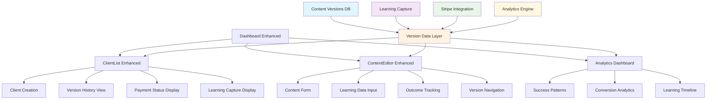

# Template Genius Activation Platform - BMAD-Orchestrated Revenue Intelligence Engine Architecture

**Document Version:** 2.0  
**Date:** August 29, 2025  
**Project:** Template Genius Activation Platform  
**Enhancement Type:** Revenue Intelligence Engine with Connected Client Journey
**Architecture Type:** Brownfield Enhancement with BMAD + Serena Orchestration

---

## Introduction

This document outlines the architectural approach for transforming Template Genius Activation Platform into a **BMAD-Orchestrated Revenue Intelligence Engine** - a connected journey learning system that captures conversion intelligence from every client interaction across all pages in the activation flow.

**Core Philosophy:**
> "Each client teaches us something about what drives revenue across their entire journey. We capture that learning automatically using AI orchestration and apply it to make the next client more likely to pay."

**Relationship to Existing Architecture:**
This document enhances existing project architecture by integrating BMAD agent orchestration and Serena MCP knowledge persistence while preserving all proven technical patterns and infrastructure investments. Where conflicts arise between new and existing patterns, this document provides guidance on maintaining consistency while implementing enhancements.

**PRD Integration:**
All requirements defined in `docs/prd.md` remain unchanged. This architecture document defines HOW to implement those requirements using AI orchestration for accelerated delivery (1-2 days vs 3 weeks).

### Existing Project Analysis

**Current Business Reality:**
- **$73,250 in signed contracts → $0 invoiced** (clients ghost after free work)
- **4.5% conversion vs 15-25% industry standard**
- **90-day runway remaining** with urgent need for revenue validation
- **CEO Philosophy:** "Execute, execute, execute" (lean startup + Alex Hormozi methodology)

**Core Business Problem:**
> "If we don't charge a fee up front, we're basically doing free consulting, hoping for a tip. This isn't a business, more like a charity." - CEO

**Current Tech Stack (PRESERVE ALL):**
- **Next.js 15.2.4, React 19, TypeScript 5.7** - Proven foundation
- **40+ Shadcn/ui components, 20+ Radix primitives** - Complete UI library
- **Hybrid mock-first + Supabase + localStorage** - Safe development approach
- **Docker + GitHub Actions CI/CD** - Proven deployment pipeline

**Available Documentation:**
- ✅ **Complete Technical Stack** - 40+ UI components documented
- ✅ **BMAD Orchestration System** - Full AI workflow integration  
- ✅ **Memory-Based Architecture** - Serena MCP knowledge persistence
- ✅ **Testing Infrastructure** - Playwright MCP browser automation
- ✅ **Business Model Context** - Revenue targets, conversion goals
- ✅ **Development Workflows** - Standard + AI-orchestrated approaches

**Identified Constraints:**
- Free tier optimization (Supabase 500MB, Vercel serverless limits)
- AI-first development (Must integrate with BMAD agent orchestration)
- Memory system continuity (Changes must update Serena knowledge base)
- Mock-first principle (Database integration cannot break development workflow)
- Testing integration (Must work with Playwright MCP automation)
- Quality gate compliance (GitHub Actions CI/CD must pass)

### Change Log

| Change | Date | Version | Description | Author |
|--------|------|---------|-------------|---------|
| BMAD-Orchestrated Revenue Intelligence | 2025-08-29 | 2.0 | Complete rebuild as connected journey learning system | Winston (Architect) |
| Initial Brownfield Architecture | 2025-01-28 | 1.0 | Original CMS + Supabase integration design | Winston (Architect) |

---

## Enhancement Scope and Integration Strategy

### Enhancement Overview

**Enhancement Type:** Revenue Intelligence Engine with Connected Client Journey  
**Scope:** Multi-page CMS + Learning capture + Payment intelligence + BMAD automation  
**Integration Impact:** Minimal - Enhanced existing components with AI-accelerated development  
**Implementation Timeline:** 1-2 days (vs 3 weeks manual) using BMAD agent orchestration

### Integration Approach

**Code Integration Strategy:** Connected Journey Learning with Component Enhancement
- Preserve existing UI components (40+ Shadcn/ui components proven and working)
- Preserve existing routing structure (Next.js App Router patterns maintained)
- Preserve existing development workflow (BMAD + Serena + Playwright critical advantage)
- Enhance components with learning fields for hypothesis capture and outcome tracking
- Implement multi-page journey management for connected client experience

**Database Integration:** Connected Journey Intelligence Data Layer with Learning Capture
```typescript
interface ConnectedJourneyDataLayer {
  // Connected journey operations
  createClientWithJourney(data: ClientData, overallHypothesis: string): Promise<ClientJourney>;
  getCompleteClientJourney(clientId: string): Promise<ClientJourney>;
  
  // Multi-page content operations for connected experience
  updateJourneyPage(
    journeyId: string, 
    pageType: 'activation' | 'agreement' | 'confirmation' | 'processing',
    content: any, 
    pageHypothesis: string
  ): Promise<JourneyPage>;
  
  // Learning capture and outcome tracking
  recordPageInteraction(journeyId: string, pageType: string, interaction: PageInteraction): Promise<void>;
  markJourneyOutcome(journeyId: string, outcome: 'paid' | 'ghosted', notes?: string): Promise<void>;
  
  // Pattern recognition and intelligence
  getJourneyIntelligence(): Promise<JourneyIntelligence>;
  identifyDropOffPatterns(): Promise<DropOffPattern[]>;
  getSuccessfulJourneyPatterns(): Promise<JourneyPattern[]>;
}

// Simplified analytics interface aligned with backend implementation
interface BasicAnalytics {
  totalVersions: number;
  successCount: number;
  failureCount: number;
  pendingCount: number;
  recentActivity: Array<{
    client: string;
    outcome: string;
    createdAt: string;
  }>;
}

// Version-based separation for client content management
const versionLayer = new VersionDataLayer();
```

**API Integration:** Version-Based Server Actions with Learning Workflow  
- Enhanced `app/actions/client-actions.ts` for client creation with initial content versions
- Enhanced `app/actions/content-actions.ts` for version management and learning capture
- New `app/actions/learning-actions.ts` for outcome tracking and analytics
- Single-responsibility version operations
- Next.js 15 App Router patterns maintained

**UI Integration:** Component Library Consistency
- Leverage existing Shadcn/ui components (Button, Card, Dialog, Tabs, Toast)
- Follow existing `cn()` utility patterns from `lib/utils.ts`
- Maintain existing theme provider and dark/light mode support
- Enhance existing dashboard tabs structure with client type visual distinction

### Compatibility Requirements

- **Existing API Compatibility:** Version-based data layer preserves all existing development patterns
- **Database Schema Compatibility:** Client-version system extends existing client structure with learning fields
- **UI/UX Consistency:** Uses existing component library and follows established design patterns  
- **Performance Impact:** Maintains <3 second load times with version-based content delivery

---

## Tech Stack Alignment

### Existing Technology Stack

| Category | Current Technology | Version | Usage in Enhancement | Notes |
|----------|-------------------|---------|---------------------|-------|
| **Core Framework** | Next.js | 15.2.4 | App Router patterns maintained | No changes to routing structure |
| | React | 19 | Component architecture preserved | Leverage concurrent features |
| | TypeScript | 5.7 | Strict mode compliance | Enhanced with data layer interfaces |
| | Node.js | 22+ | Runtime maintained | Alpine Docker compatibility |
| **UI & Styling** | Tailwind CSS | 4.1.9 | Consistent styling patterns | No new utility classes needed |
| | Shadcn/ui | 40+ components | Reuse Button, Card, Dialog, Tabs, Toast | No new component additions |
| | Radix UI | 20+ primitives | Accessibility patterns maintained | Form, Select for client type picker |
| | CVA | 0.7.1 | Component variants for client types | Test/Live/Demo visual distinction |
| | Geist Fonts | Latest | Typography consistency | No changes |
| | Lucide React | 0.454.0 | Icons for client type indicators | Database, Test, User icons |
| **Data & Forms** | React Hook Form | 7.60.0 | Enhanced ContentEditor forms | Same validation patterns |
| | Zod | 3.25.67 | Client type validation schemas | Enhanced with test/live validation |
| | Supabase | 2.56.0 | Clean data layer implementation | Enhanced client configuration |
| **Development Tools** | pnpm | Latest | Package management maintained | No changes to existing workflow |
| | Docker | Latest | Containerized development preserved | No changes to Dockerfile |
| | BMAD + Serena | Current | AI-orchestrated development | Enhanced with clean architecture |
| | Playwright MCP | Current | Browser testing automation | Test client vs live client testing |

### Required New Dependencies

Essential dependencies for core business functionality:

| Technology | Version | Purpose | Rationale | Integration Method |
|------------|---------|---------|-----------|-------------------|
| **@stripe/stripe-js** | ^2.4.0 | Client-side payment processing | Required for $500 activation fee collection (core PRD requirement) | React components for checkout flow |
| **stripe** | ^14.21.0 | Server-side payment processing | Required for webhook handling and payment confirmation | Next.js API routes integration |
| **@types/stripe** | ^8.0.0 | TypeScript support for Stripe | Type safety for payment processing | Development dependency |
| **@supabase/postgres-js** | ^2.1.0 | Enhanced database connection pooling | Free tier connection optimization | Enhanced database client |

### Enhanced Environment Configuration

```typescript
interface EnvConfig {
  // Existing (preserved)
  NEXT_PUBLIC_SUPABASE_URL: string;
  NEXT_PUBLIC_SUPABASE_ANON_KEY: string;
  SUPABASE_SERVICE_ROLE_KEY: string;
  
  // Required new for payment processing
  STRIPE_SECRET_KEY: string;
  STRIPE_WEBHOOK_SECRET: string;  
  NEXT_PUBLIC_STRIPE_PUBLISHABLE_KEY: string;
}
```

### Technology Integration Strategy

**Version-Based Data Layer Implementation:**
```typescript
// Enhanced TypeScript interfaces for version-based architecture
interface Client {
  id: UUID;
  company: string;
  contact: string;
  email: string;
  activationToken: string;        // G[4-digit] format
  currentVersionId?: UUID;        // Links to active content version
  status: 'pending' | 'active' | 'paid' | 'failed';
  createdAt: Date;
}

// Content version model with learning capture
interface ContentVersion {
  id: UUID;
  clientId: UUID;
  pageType: 'activation' | 'agreement' | 'confirmation' | 'processing';
  content: JSONB;
  iterationNotes: string;         // "Why this change?" - PRD requirement
  hypothesis: string;             // Expected outcome - PRD requirement
  outcome: 'success' | 'failure' | 'pending'; // Result tracking - PRD requirement
  isCurrent: boolean;            // Active version flag
  versionNumber: number;         // Sequential versioning
  createdBy: string;
  createdAt: Date;
}

// Learning data for content updates
interface LearningData {
  iterationNotes: string;        // Rationale for content change
  hypothesis: string;           // Expected outcome
}

// Version-based data layer operations
interface VersionDataLayer {
  // Client operations
  createClientWithFirstVersion(data: ClientData): Promise<{ client: Client; contentVersion: ContentVersion }>;
  getClientContentHistory(clientId: string): Promise<ContentVersion[]>;
  
  // Content version operations
  updateClientContent(clientId: string, pageType: string, content: any, learning: LearningData): Promise<ContentVersion>;
  markContentOutcome(versionId: string, outcome: 'success' | 'failure', notes?: string): Promise<ContentVersion>;
  
  // Client activation
  getClientActivationContent(activationToken: string): Promise<{ client: Client; content: any; versionId: string }>;
  
  // Analytics operations
  getConversionAnalytics(): Promise<ConversionAnalytics>;
  getSuccessPatterns(): Promise<ContentPattern[]>;
}
```

This technology alignment preserves the existing sophisticated development ecosystem (BMAD orchestration, Serena memory, Playwright testing, 40+ component library) while adding only essential dependencies required for core business functionality.

---

## Data Models and Schema Changes

### New Data Models

#### **Enhanced Client Model**
**Purpose:** Extend existing client structure with activation token generation and content version tracking  
**Integration:** Builds on existing client table structure with direct content versioning

**Key Attributes:**
- `activation_token: string` - G[4-digit] unique token with collision detection
- `current_version_id: UUID` - Links to currently active content version for this client
- `status: string` - 'pending', 'active', 'paid', 'failed' for workflow tracking
- `metadata: JSONB` - Flexible storage for client-specific analytics and iteration tracking

**Relationships:**
- **With Existing:** Extends current client structure without breaking changes
- **With New:** Direct relationship to content_versions for client-specific content

#### **Content Versions Model (PRD-Required)**
**Purpose:** Client-specific content versioning with complete learning capture system  
**Integration:** Core model enabling "each client becomes a controlled experiment" workflow

**Key Attributes:**
- `client_id: UUID` - Direct reference to clients(id) for content ownership
- `page_type: string` - 'activation', 'agreement', 'confirmation', 'processing'
- `content: JSONB` - Full page content structure for complete customization
- `iteration_notes: TEXT` - "Why this change?" rationale capture (PRD requirement)
- `hypothesis: TEXT` - Expected outcome for learning (PRD requirement)
- `outcome: VARCHAR(20)` - 'success', 'failure', 'pending' tracking (PRD requirement)
- `is_current: boolean` - Marks the active version for each client/page combination
- `version_number: integer` - Sequential version tracking per client
- `created_by: TEXT` - Admin user tracking
- `metadata: JSONB` - Additional analytics and context

**Relationships:**
- **With Existing:** References clients table for content ownership
- **With New:** Referenced by payments for conversion analysis

#### **Payment Records Model**
**Purpose:** Track payment processing with content version analytics for business validation  
**Integration:** Stripe payment integration with direct content-version conversion tracking

**Key Attributes:**
- `client_id: UUID` - References clients(id) for payment tracking
- `content_version_id: UUID` - References content_versions(id) for precise conversion analytics
- `stripe_payment_intent_id: string` - Stripe payment reference (unique)
- `amount: integer` - Payment amount in cents (50000 for $500)
- `status: string` - 'pending', 'succeeded', 'failed', 'cancelled'
- `created_at: TIMESTAMP` - Payment timing for analytics

**Relationships:**
- **With Existing:** References clients table
- **With New:** Links to content_versions for exact content-conversion tracking

### PRD-Aligned Schema Implementation

**Database Changes Required:**

**New Tables:**
- `content_versions` - Client-specific content versions with learning capture
- `payments` - Payment processing with content version tracking

**Modified Tables:**  
- `clients` - Add activation_token, current_version_id, status fields

**New Indexes:**
- `clients.activation_token` - Unique constraint and fast lookup for activation URLs
- `content_versions.client_id` - Fast content retrieval per client
- `content_versions.is_current` - Quick access to active versions
- `payments.content_version_id` - Fast conversion analytics by content version

**Migration Strategy:**
```sql
-- Phase 1: Extend existing clients table (PRD-compliant)
ALTER TABLE clients ADD COLUMN activation_token VARCHAR(5) UNIQUE;
ALTER TABLE clients ADD COLUMN current_version_id UUID;
ALTER TABLE clients ADD COLUMN status VARCHAR(20) DEFAULT 'pending';

-- Phase 2: Create PRD-required content versioning system
CREATE TABLE content_versions (
  id UUID PRIMARY KEY DEFAULT gen_random_uuid(),
  client_id UUID REFERENCES clients(id) ON DELETE CASCADE,
  page_type VARCHAR(50) NOT NULL, -- 'activation', 'agreement', 'confirmation', 'processing'
  content JSONB NOT NULL,
  iteration_notes TEXT,           -- PRD requirement: "Why this change?"
  hypothesis TEXT,               -- PRD requirement: Expected outcome
  outcome VARCHAR(20),           -- PRD requirement: success/failure/pending
  is_current BOOLEAN DEFAULT false, -- Marks active version
  version_number INTEGER,        -- Sequential versioning
  created_at TIMESTAMP DEFAULT NOW(),
  created_by TEXT DEFAULT 'admin',
  metadata JSONB DEFAULT '{}'
);

-- Phase 3: Payment tracking with content-version linking
CREATE TABLE payments (
  id UUID PRIMARY KEY DEFAULT gen_random_uuid(),
  client_id UUID REFERENCES clients(id) ON DELETE CASCADE,
  content_version_id UUID REFERENCES content_versions(id), -- Links payment to exact content
  stripe_payment_intent_id VARCHAR(255),
  amount INTEGER NOT NULL,
  status VARCHAR(20) NOT NULL,
  created_at TIMESTAMP DEFAULT NOW()
);

-- Phase 4: Proper constraints and triggers
ALTER TABLE clients ADD CONSTRAINT fk_clients_current_version 
  FOREIGN KEY (current_version_id) REFERENCES content_versions(id);

-- Ensure only one current version per client per page type
CREATE UNIQUE INDEX idx_content_versions_current 
  ON content_versions(client_id, page_type) 
  WHERE is_current = true;

-- Auto-increment version numbers per client
CREATE OR REPLACE FUNCTION set_version_number()
RETURNS TRIGGER AS $$
BEGIN
  SELECT COALESCE(MAX(version_number), 0) + 1 
  INTO NEW.version_number
  FROM content_versions 
  WHERE client_id = NEW.client_id AND page_type = NEW.page_type;
  RETURN NEW;
END;
$$ LANGUAGE plpgsql;

CREATE TRIGGER set_version_number_trigger
  BEFORE INSERT ON content_versions
  FOR EACH ROW EXECUTE FUNCTION set_version_number();

-- Phase 5: Token generation function with collision detection
CREATE OR REPLACE FUNCTION generate_activation_token()
RETURNS VARCHAR AS $$
DECLARE
    token VARCHAR(5);
BEGIN
    LOOP
        token := 'G' || LPAD((RANDOM() * 9999)::INTEGER::TEXT, 4, '0');
        EXIT WHEN NOT EXISTS (SELECT 1 FROM clients WHERE activation_token = token);
    END LOOP;
    RETURN token;
END;
$$ LANGUAGE plpgsql;
```

**PRD Workflow Support:**
- Client-centric design enables true content isolation per client
- Learning fields (`iteration_notes`, `hypothesis`, `outcome`) support admin workflow
- Version management with `is_current` flag and auto-incrementing version numbers
- Payment-content linking enables precise conversion tracking

**Storage Efficiency (Free Tier Compliant):**
- Each content version ~20-50KB (within PRD limits)
- 100 clients × 4 page types × 5 versions = ~100MB (well under 500MB limit)
- Learning data enables business intelligence without additional storage cost

---

## Component Architecture

### New Components

#### **Enhanced ClientList Component**
**Responsibility:** Extend existing ClientList.tsx with client version management and learning capture  
**Integration Points:** Builds on existing dashboard component with PRD-aligned workflow support

**Key Interfaces:**
- `features.versionHistory: boolean` - Show content version history per client
- `features.paymentTracking: boolean` - Display payment status and analytics
- `features.learningCapture: boolean` - Show iteration notes and outcome tracking

**Dependencies:**
- **Existing Components:** Leverages existing `Card`, `Button`, `Dialog`, `Table`, `Badge` components
- **New Components:** None - self-contained enhancements

**Technology Stack:** Existing React Hook Form + Zod validation + version-based data layer + existing Shadcn UI patterns

```typescript
interface EnhancedClientListProps {
  features: {
    versionHistory: boolean;     // Changed from templateAssignment
    paymentTracking: boolean;
    learningCapture: boolean;    // New: Shows iteration notes and outcomes
  };
}

// Enhanced component with client-version workflow
function ClientList({ features = { versionHistory: true, paymentTracking: true, learningCapture: true } }) {
  const { getClientContentHistory } = useClientActions();
  
  return (
    <div className="space-y-6">
      <ClientCreationForm onSubmit={createClientWithFirstVersion} />
      
      <ClientTable>
        {clients.map(client => (
          <ClientRow key={client.id}>
            <ClientInfo client={client} />
            <ActivationToken token={client.activationToken} />
            {features.paymentTracking && <PaymentStatusBadge client={client} />}
            {features.versionHistory && <VersionCount client={client} />}
            {features.learningCapture && <OutcomeIndicator version={client.currentVersion} />}
          </ClientRow>
        ))}
      </ClientTable>
    </div>
  );
}
```

#### **Enhanced ContentEditor Component**
**Responsibility:** Extend existing ContentEditor.tsx with client-specific version management and learning capture  
**Integration Points:** Builds on existing content editing patterns with PRD learning workflow

**Key Interfaces:**
- `client: Client` - Client context for version management
- `currentVersion: ContentVersion` - Active content version being edited
- `onSaveWithLearning(content: Content, learning: LearningData)` - Save with rationale capture
- `onMarkOutcome(outcome: 'success' | 'failure', notes?: string)` - Track iteration results

**Dependencies:**
- **Existing Components:** Enhances existing `ContentEditor.tsx` with version tracking
- **New Components:** Integrates with enhanced `ClientList` for client context

**Technology Stack:** Existing content editing patterns + version-based data layer + React Hook Form + Shadcn UI

```typescript
interface EnhancedContentEditorProps {
  client: Client;
  currentVersion: ContentVersion;
  pageType: 'activation' | 'agreement' | 'confirmation' | 'processing';
}

interface LearningData {
  iterationNotes: string;    // "Why this change?"
  hypothesis: string;        // Expected outcome
}

// Enhanced component with learning workflow
function ContentEditor({ client, currentVersion, pageType }) {
  const { updateClientContent, markContentOutcome } = useContentActions();
  const [learningData, setLearningData] = useState<LearningData>();
  
  return (
    <div className="space-y-6">
      <ClientContext>
        <Badge>Editing for: {client.company}</Badge>
        <Badge>Version: #{currentVersion.versionNumber}</Badge>
        <Badge>Status: {currentVersion.outcome}</Badge>
      </ClientContext>
      
      <ContentForm 
        client={client}
        content={currentVersion.content}
        onSave={(content) => updateClientContent(
          client.id, 
          pageType, 
          content, 
          learningData
        )}
      />
      
      <LearningCapture>
        <Textarea 
          label="Why this change?"
          value={learningData?.iterationNotes}
          onChange={(e) => setLearningData({...learningData, iterationNotes: e.target.value})}
        />
        <Textarea 
          label="Expected outcome"
          value={learningData?.hypothesis}
          onChange={(e) => setLearningData({...learningData, hypothesis: e.target.value})}
        />
      </LearningCapture>
      
      <OutcomeTracking>
        <Button onClick={() => markContentOutcome(currentVersion.id, 'success')}>Mark Success</Button>
        <Button onClick={() => markContentOutcome(currentVersion.id, 'failure')}>Mark Failure</Button>
      </OutcomeTracking>
    </div>
  );
}
```

#### **Dashboard Analytics Component**
**Responsibility:** Analytics display for content version performance and learning insights  
**Integration Points:** New dashboard tab using existing Card and Chart patterns

**Key Interfaces:**
- `getConversionAnalytics()` - Success/failure patterns from content versions
- `getSuccessPatterns()` - Identify content elements that drive conversion
- `getClientIterationHistory()` - Learning timeline per client

**Dependencies:**
- **Existing Components:** Uses existing `Card`, `Badge`, `Table` components for display
- **New Components:** Integrates with enhanced components for data context

**Technology Stack:** Version-based data layer + existing dashboard patterns + existing Chart components (if available)

```typescript
// Simplified analytics aligned with backend implementation
function DashboardAnalytics() {
  const { getLearningAnalytics } = useAnalytics();
  const [analytics, setAnalytics] = useState<BasicAnalytics>();
  
  return (
    <div className="grid grid-cols-1 md:grid-cols-3 gap-6">
      <Card>
        <CardHeader>
          <CardTitle>Content Version Outcomes</CardTitle>
        </CardHeader>
        <CardContent>
          <div className="space-y-2">
            <div>Total Versions: {analytics?.totalVersions}</div>
            <Badge variant="default">Success: {analytics?.successCount}</Badge>
            <Badge variant="destructive">Failed: {analytics?.failureCount}</Badge>
            <Badge variant="secondary">Pending: {analytics?.pendingCount}</Badge>
          </div>
        </CardContent>
      </Card>
      
      <Card>
        <CardHeader>
          <CardTitle>Recent Activity</CardTitle>
        </CardHeader>
        <CardContent>
          <div className="space-y-2">
            {analytics?.recentActivity.map((activity, index) => (
              <div key={index} className="flex justify-between">
                <span>{activity.client}</span>
                <Badge variant={activity.outcome === 'success' ? 'default' : 'secondary'}>
                  {activity.outcome}
                </Badge>
              </div>
            ))}
          </div>
        </CardContent>
      </Card>
      
      <Card>
        <CardHeader>
          <CardTitle>Manual Pattern Notes</CardTitle>
        </CardHeader>
        <CardContent>
          <div className="text-sm text-muted-foreground">
            Use the success/failure data to manually identify patterns.
            Complex pattern analysis will be added in Phase II.
          </div>
        </CardContent>
      </Card>
    </div>
  );
}
```

### Component Integration Strategy

**Enhancement Over Creation Approach:**
- **ClientList.tsx** → Enhanced with version history, payment tracking, learning capture
- **ContentEditor.tsx** → Enhanced with version management and learning workflow  
- **Dashboard** → Enhanced with new analytics tab focused on iteration insights
- **Version-Based Data Layer** → Manages client content versions and learning capture

**State Management Strategy:**
```typescript
// Version-based data layer for PRD workflow
interface VersionDataLayer {
  // Client operations
  createClientWithFirstVersion(data: ClientData): Promise<Client>;
  getClientContentHistory(clientId: string): Promise<ContentVersion[]>;
  
  // Content version operations
  updateClientContent(clientId: string, pageType: string, content: any, learning: LearningData): Promise<ContentVersion>;
  markContentOutcome(versionId: string, outcome: 'success' | 'failure', notes?: string): Promise<void>;
  
  // Analytics operations
  getConversionAnalytics(): Promise<ConversionAnalytics>;
  getSuccessPatterns(): Promise<ContentPattern[]>;
}

// Components use version-based operations
const ContentEditorEnhanced = () => {
  const { updateClientContent, markContentOutcome } = useVersionDataLayer();
  // Component logic with learning capture
};
```

### Component Interaction Diagram



**Benefits of Version-Based Component Approach:**
- **Direct Client Control** - Each client has independent content versions with full customization
- **Complete Learning Capture** - Every iteration tracked with rationale, hypothesis, and outcomes
- **Clear Workflow Support** - Components directly support PRD admin user stories
- **Conversion Analytics** - Precise tracking of which content versions drive payment
- **Rapid Iteration** - Create new versions instantly without affecting other clients
- **Business Intelligence** - Pattern recognition from successful vs failed iterations

This component architecture enables the PRD's core "rapid client-specific content iteration with learning capture" workflow while preserving existing UI investments and development patterns.

---

## API Design and Integration

### API Integration Strategy

**API Integration Strategy:** Client-Version Server Actions with Learning Workflow Support  
**Authentication:** No authentication required (validation phase - single admin access)  
**Versioning:** No API versioning needed - server actions with direct database operations

### PRD-Aligned Server Actions

#### **Client Management Server Actions**
**Function:** `createClientWithFirstVersion(formData: FormData)`  
**Purpose:** Atomic client creation with activation token and initial content version  
**Integration:** PRD-compliant workflow supporting immediate content editing capability

```typescript
export async function createClientWithFirstVersion(formData: FormData): Promise<ClientCreationResult> {
  const clientData = validateClientData(formData);
  
  // Atomic operation creating client + initial content version
  const result = await db.transaction(async (tx) => {
    // Generate unique activation token with collision detection
    const activationToken = await generateActivationToken();
    
    // Create client record
    const client = await tx.clients.create({
      company: clientData.company,
      contact: clientData.contact,
      email: clientData.email,
      activationToken,
      status: 'pending'
    });
    
    // Create initial content version for activation page
    const contentVersion = await tx.contentVersions.create({
      clientId: client.id,
      pageType: 'activation',
      content: getDefaultActivationContent(),
      isCurrent: true,
      versionNumber: 1,
      iterationNotes: 'Initial content version created',
      hypothesis: 'Default content will establish baseline conversion',
      outcome: 'pending',
      createdBy: 'admin'
    });
    
    // Link client to current version
    await tx.clients.update(client.id, { 
      currentVersionId: contentVersion.id 
    });
    
    return { client, contentVersion };
  });
  
  revalidatePath('/dashboard');
  return result;
}
```

#### **Content Management Server Actions**
**Function:** `updateClientContent(clientId: string, pageType: string, content: any, learningData: LearningData)`  
**Purpose:** Create new content version with complete learning capture  
**Integration:** Core PRD workflow enabling "edit content for specific clients with rationale capture"

```typescript
interface LearningData {
  iterationNotes: string;    // "Why this change?" - PRD requirement
  hypothesis: string;        // Expected outcome - PRD requirement
}

export async function updateClientContent(
  clientId: string, 
  pageType: string, 
  content: any, 
  learningData: LearningData
): Promise<ContentVersion> {
  
  const result = await db.transaction(async (tx) => {
    // Deactivate current version
    await tx.contentVersions.updateMany({
      where: { clientId, pageType, isCurrent: true },
      data: { isCurrent: false }
    });
    
    // Create new version with learning capture
    const newVersion = await tx.contentVersions.create({
      clientId,
      pageType,
      content,
      iterationNotes: learningData.iterationNotes,
      hypothesis: learningData.hypothesis,
      outcome: 'pending',
      isCurrent: true,
      createdBy: 'admin'
    });
    
    // Update client's current version pointer (if activation page)
    if (pageType === 'activation') {
      await tx.clients.update(clientId, { 
        currentVersionId: newVersion.id 
      });
    }
    
    return newVersion;
  });
  
  revalidatePath('/dashboard');
  revalidatePath(`/activate/[token]`, 'page'); // Invalidate client page cache
  return result;
}

// Learning workflow support
export async function markContentOutcome(
  versionId: string, 
  outcome: 'success' | 'failure', 
  notes?: string
): Promise<ContentVersion> {
  
  const updatedVersion = await db.contentVersions.update(versionId, {
    outcome,
    metadata: { 
      outcomeNotes: notes,
      markedAt: new Date().toISOString()
    }
  });
  
  revalidatePath('/dashboard');
  return updatedVersion;
}
```

#### **Payment Processing Server Actions**
**Function:** `createPaymentSession(clientId: string)`  
**Purpose:** Handle payment session creation with content version tracking  
**Integration:** Stripe integration with precise content-conversion analytics

```typescript
export async function createPaymentSession(clientId: string): Promise<PaymentSessionResult> {
  const client = await db.clients.findUnique({
    where: { id: clientId },
    include: { currentVersion: true }
  });
  
  if (!client) {
    throw new Error('Client not found');
  }
  
  // Get client's current content version at payment time
  const activeVersion = await db.contentVersions.findFirst({
    where: { 
      clientId: client.id, 
      pageType: 'activation', 
      isCurrent: true 
    }
  });
  
  // Real Stripe payment with content version metadata
  const session = await stripe.checkout.sessions.create({
    line_items: [{
      price_data: {
        currency: 'usd',
        product_data: {
          name: 'Priority Access Activation',
          description: 'Genius recruitment priority access'
        },
        unit_amount: 50000 // $500.00
      },
      quantity: 1
    }],
    mode: 'payment',
    success_url: `${process.env.NEXT_PUBLIC_URL}/confirmation?client=${clientId}`,
    cancel_url: `${process.env.NEXT_PUBLIC_URL}/activate/${client.activationToken}`,
    metadata: {
      clientId: client.id,
      contentVersionId: activeVersion?.id || '' // CRITICAL: Link payment to exact content
    }
  });
  
  return { 
    success: true, 
    sessionUrl: session.url,
    sessionId: session.id 
  };
}

// Client activation support
export async function getClientActivationContent(activationToken: string): Promise<ClientActivationData> {
  const client = await db.clients.findUnique({
    where: { activationToken },
    include: { currentVersion: true }
  });
  
  if (!client) {
    throw new Error('Invalid activation token');
  }
  
  // Get current content version for this client
  const contentVersion = await db.contentVersions.findFirst({
    where: { 
      clientId: client.id, 
      pageType: 'activation', 
      isCurrent: true 
    }
  });
  
  return {
    client,
    content: contentVersion?.content || getDefaultActivationContent(),
    versionId: contentVersion?.id
  };
}
```

### Required External API Endpoints

#### **Stripe Webhook Handler**
**Method:** POST  
**Endpoint:** `/api/webhooks/stripe`  
**Purpose:** Handle Stripe payment confirmations and update client/payment records  
**Integration:** Required external API for Stripe webhook processing

```typescript
// app/api/webhooks/stripe/route.ts
import { headers } from 'next/headers';
import { NextResponse } from 'next/server';
import Stripe from 'stripe';

const stripe = new Stripe(process.env.STRIPE_SECRET_KEY!);

export async function POST(req: Request) {
  const body = await req.text();
  const signature = headers().get('stripe-signature')!;
  
  let event: Stripe.Event;
  
  try {
    event = stripe.webhooks.constructEvent(
      body,
      signature,
      process.env.STRIPE_WEBHOOK_SECRET!
    );
  } catch (err) {
    console.error('Webhook signature verification failed:', err);
    return NextResponse.json({ error: 'Invalid signature' }, { status: 400 });
  }
  
  switch (event.type) {
    case 'checkout.session.completed':
      const session = event.data.object as Stripe.Checkout.Session;
      
      await db.payments.create({
        clientId: session.metadata?.clientId!,
        templateId: session.metadata?.templateId!,
        stripePaymentIntentId: session.payment_intent as string,
        amount: session.amount_total!,
        status: 'succeeded'
      });
      
      await db.clients.update(session.metadata?.clientId!, {
        status: 'activated',
        activatedAt: new Date()
      });
      
      break;
      
    case 'checkout.session.expired':
    case 'payment_intent.payment_failed':
      // Handle failed payments
      const failedSession = event.data.object as Stripe.Checkout.Session;
      
      await db.payments.create({
        clientId: failedSession.metadata?.clientId!,
        templateId: failedSession.metadata?.templateId!,
        stripePaymentIntentId: failedSession.payment_intent as string || 'failed',
        amount: failedSession.amount_total || 50000,
        status: 'failed'
      });
      
      break;
  }
  
  return NextResponse.json({ received: true });
}
```

### Server Action Integration Strategy

**Component Integration Pattern:**
```typescript
// Enhanced components use server actions directly
function ClientCreationForm() {
  const [state, formAction] = useFormState(createClientWithType, initialState);
  const { pending } = useFormStatus();
  
  return (
    <form action={formAction}>
      <Select name="type" defaultValue="test">
        <SelectItem value="test">Test Client</SelectItem>
        <SelectItem value="live">Live Client</SelectItem>
        <SelectItem value="demo">Demo Client</SelectItem>
      </Select>
      
      <Input name="company" placeholder="Company Name" required />
      <Input name="contact" placeholder="Contact Name" required />
      <Input name="email" type="email" placeholder="Email" required />
      
      <Button type="submit" disabled={pending}>
        {pending ? 'Creating...' : 'Create Client'}
      </Button>
    </form>
  );
}

// Payment processing integration
function PaymentButton({ clientId }: { clientId: string }) {
  const [pending, startTransition] = useTransition();
  
  const handlePayment = () => {
    startTransition(async () => {
      const result = await createPaymentSession(clientId);
      if (result.sessionUrl) {
        window.location.href = result.sessionUrl;
      } else if (result.redirectUrl) {
        router.push(result.redirectUrl);
      }
    });
  };
  
  return (
    <Button onClick={handlePayment} disabled={pending}>
      {pending ? 'Processing...' : 'Pay $500 Activation Fee'}
    </Button>
  );
}
```

**Benefits of Server Actions Approach:**
- **Atomic Operations** - Single functions handle complete business logic
- **Type Safety** - End-to-end TypeScript validation without API boundaries
- **Simplified Error Handling** - Native JavaScript error handling and React error boundaries
- **Better Performance** - No HTTP serialization overhead for internal operations
- **Easier Testing** - Test server actions directly without API mocking
- **Faster Development** - No API contract design and maintenance overhead

This API design maintains Next.js 15 App Router best practices while enabling efficient business validation through simplified server-side operations and minimal external API surface area.

---

## External API Integration

### Stripe API Integration

#### **Stripe API**
- **Purpose:** Payment processing for live clients and webhook handling
- **Documentation:** https://stripe.com/docs/api
- **Base URL:** https://api.stripe.com/v1
- **Authentication:** Bearer token authentication with secret key
- **Integration Method:** Official Stripe Node.js SDK with TypeScript support

**Key Endpoints Used:**
- `POST /v1/customers` - Create Stripe customers for live clients
- `POST /v1/checkout/sessions` - Create payment sessions for $500 activation fee
- `POST /v1/webhook_endpoints` - Webhook endpoint configuration for payment confirmations

**Error Handling:** Comprehensive error handling with retry logic for network failures, webhook verification, and payment processing failures with fallback to manual processing

---

## Source Tree Integration

### Existing Project Structure
```
template-genius-activation/
├── app/
│   ├── dashboard/
│   │   ├── page.tsx                 # Enhanced with version analytics tab
│   │   └── components/
│   │       ├── ClientList.tsx       # Enhanced with version history display
│   │       └── ContentEditor.tsx    # Enhanced with learning capture
│   ├── actions/
│   │   ├── client-actions.ts        # Enhanced with createClientWithFirstVersion
│   │   ├── content-actions.ts       # Enhanced with version management
│   │   └── learning-actions.ts      # New - Learning workflow actions
│   └── api/webhooks/stripe/
│       └── route.ts                 # New - Stripe webhook handler
├── components/ui/                   # Existing 40+ Shadcn components (unchanged)
├── lib/
│   ├── supabase.ts                 # Enhanced with version-based data layer
│   └── stripe.ts                   # New - Stripe client configuration
└── supabase/
    └── migrations/                  # New - Database migration files
```

### New File Organization
```
template-genius-activation/
├── app/
│   ├── actions/
│   │   └── learning-actions.ts      # Learning workflow server actions
│   └── api/webhooks/stripe/
│       └── route.ts                 # Stripe webhook handler
├── lib/
│   ├── data-layers/                 # New - Version-based data layer implementations
│   │   ├── version-data-layer.ts   # Client version management
│   │   ├── learning-capture.ts     # Learning workflow logic
│   │   └── analytics-engine.ts     # Success pattern analysis
│   ├── stripe.ts                   # New - Stripe SDK configuration
│   └── validation/                  # New - Zod schemas for validation
│       ├── client-schemas.ts       # Client creation and update validation
│       ├── version-schemas.ts      # Content version validation
│       └── learning-schemas.ts     # Learning data validation
└── supabase/
    └── migrations/
        ├── 001-add-client-fields.sql    # Add activation_token, current_version_id, status
        ├── 002-create-content-versions.sql # Create content versioning system
        └── 003-create-payments.sql      # Create payments with version tracking
```

### Integration Guidelines
- **File Naming:** Follows existing kebab-case convention for TypeScript files
- **Folder Organization:** Groups related functionality (data-layers, validation) in dedicated folders
- **Import/Export Patterns:** Uses existing barrel exports and path aliases (@/lib, @/components)

---

## Infrastructure and Deployment Integration

### Existing Infrastructure
**Current Deployment:** Vercel hosting with automatic deployments from GitHub, Docker containerization support  
**Infrastructure Tools:** GitHub Actions for CI/CD, Docker for containerized development, pnpm for package management  
**Environments:** Development (local), Preview (Vercel branch deployments), Production (main branch)

### Enhancement Deployment Strategy
**Deployment Approach:** Gradual rollout using existing Vercel infrastructure with feature flags  
**Infrastructure Changes:** New environment variables for Stripe integration, database migration execution  
**Pipeline Integration:** Enhanced GitHub Actions workflow to include database migrations and environment validation

### Rollback Strategy
**Rollback Method:** Database migration rollback scripts with feature flag disabling for instant rollback  
**Risk Mitigation:** Feature flags allow disabling enhancements without code deployment, database backups before major migrations  
**Monitoring:** Enhanced logging for payment processing, client creation, and template operations with Vercel Analytics

---

## Coding Standards and Conventions

### Existing Standards Compliance
**Code Style:** TypeScript strict mode with existing ESLint configuration, Prettier formatting  
**Linting Rules:** Next.js recommended rules with TypeScript strict configuration  
**Testing Patterns:** Playwright MCP integration for browser automation testing  
**Documentation Style:** JSDoc comments for complex business logic, inline comments for architectural decisions

### Enhancement-Specific Standards
- **Server Actions:** Use FormData for form submissions, return typed results with error handling
- **Data Layer Separation:** Implement factory pattern for client type-based data access
- **Template Management:** Use consistent naming convention for template types and content structure
- **Payment Processing:** Implement comprehensive error handling with fallback mechanisms

### Critical Integration Rules
- **Existing API Compatibility:** All existing mock-first patterns preserved through data layer abstraction
- **Database Integration:** Use transactions for multi-step operations, implement proper error handling and rollback
- **Error Handling:** Use React Error Boundaries for component-level errors, server actions for server-side validation
- **Logging Consistency:** Structured logging for payment events, client operations, and template management

---

## Testing Strategy

### Integration with Existing Tests
**Existing Test Framework:** Playwright MCP for browser automation and end-to-end testing  
**Test Organization:** Component-level tests for enhanced UI, integration tests for server actions  
**Coverage Requirements:** Maintain existing development velocity while ensuring payment processing reliability

### New Testing Requirements

#### **Unit Tests for New Components**
- **Framework:** Playwright MCP with Jest for server action testing
- **Location:** `__tests__/` directories alongside enhanced components
- **Coverage Target:** 90% coverage for payment processing, 80% for content management
- **Integration with Existing:** Extends existing test patterns with enhanced component testing

#### **Integration Tests**
- **Scope:** End-to-end client creation, template assignment, and payment processing flows
- **Existing System Verification:** Ensures enhanced components don't break existing functionality
- **New Feature Testing:** Test client type segmentation, template-based content delivery, Stripe integration

#### **Regression Testing**
- **Existing Feature Verification:** Automated testing of current dashboard and content management functionality
- **Automated Regression Suite:** Playwright MCP scripts for critical user journeys
- **Manual Testing Requirements:** Payment processing validation, Stripe webhook testing, template performance verification

---

## Security Integration

### Existing Security Measures
**Authentication:** Currently public access (acknowledged limitation for validation phase)  
**Authorization:** No user-based authorization (single admin interface)  
**Data Protection:** Environment variables for sensitive configuration, HTTPS enforced by Vercel  
**Security Tools:** TypeScript strict mode for type safety, Next.js built-in security features

### Enhancement Security Requirements
**New Security Measures:** Stripe webhook signature verification, input validation with Zod schemas, rate limiting for payment operations  
**Integration Points:** Server actions with comprehensive validation, secure environment variable management for Stripe keys  
**Compliance Requirements:** PCI compliance through Stripe Checkout (no card data stored), basic data protection for client information

### Security Testing
**Existing Security Tests:** Basic input validation through TypeScript strict mode  
**New Security Test Requirements:** Stripe webhook signature validation testing, payment flow security testing, client data protection verification  
**Penetration Testing:** Manual testing of payment flows, webhook endpoint security, client data access patterns

---

## Next Steps

### Story Manager Handoff
Create implementation stories for BMAD orchestration with this architectural guidance:

**Reference this architecture document** for comprehensive technical decisions and integration patterns validated through interactive design process. **Key integration requirements** include test/live client segmentation, template-based content management, and clean data layer separation. **Existing system constraints** based on Next.js 15 App Router, 40+ Shadcn/ui components, and Supabase hybrid architecture.

**First story to implement:** "Enhance ClientList component with client type selection" - establishes foundation for segmentation with clear integration checkpoints and validation against existing UI patterns. **Emphasis on maintaining existing system integrity** throughout implementation by leveraging established component patterns and data access methods.

### Developer Handoff
Begin implementation using enhanced server actions and strategic component enhancement:

**Reference this architecture and existing coding standards** analyzed from Next.js 15 App Router patterns, TypeScript strict mode, and Shadcn/ui component library. **Integration requirements** focus on preserving existing development workflow while enabling template-based content management and payment processing.

**Key technical decisions** include server actions over REST APIs, template-based content storage for efficiency, and test/live client segmentation for business validation. **Existing system compatibility requirements** with specific verification steps ensure enhanced components integrate seamlessly with current dashboard and content management patterns.

**Clear sequencing of implementation** prioritizes client type selection, then template management, then payment integration to minimize risk to existing functionality while enabling progressive business validation.

---
