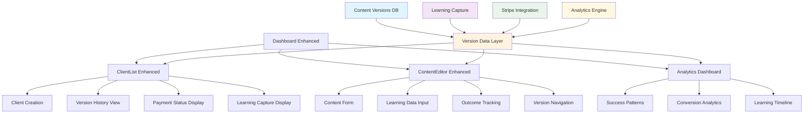

# Component Architecture

## New Components

### **Enhanced ClientList Component**
**Responsibility:** Extend existing ClientList.tsx with client version management and learning capture  
**Integration Points:** Builds on existing dashboard component with PRD-aligned workflow support

**Key Interfaces:**
- `features.versionHistory: boolean` - Show content version history per client
- `features.paymentTracking: boolean` - Display payment status and analytics
- `features.learningCapture: boolean` - Show iteration notes and outcome tracking

**Dependencies:**
- **Existing Components:** Leverages existing `Card`, `Button`, `Dialog`, `Table`, `Badge` components
- **New Components:** None - self-contained enhancements

**Technology Stack:** Existing React Hook Form + Zod validation + version-based data layer + existing Shadcn UI patterns

```typescript
interface EnhancedClientListProps {
  features: {
    versionHistory: boolean;     // Changed from templateAssignment
    paymentTracking: boolean;
    learningCapture: boolean;    // New: Shows iteration notes and outcomes
  };
}

// Enhanced component with client-version workflow
function ClientList({ features = { versionHistory: true, paymentTracking: true, learningCapture: true } }) {
  const { getClientContentHistory } = useClientActions();
  
  return (
    <div className="space-y-6">
      <ClientCreationForm onSubmit={createClientWithFirstVersion} />
      
      <ClientTable>
        {clients.map(client => (
          <ClientRow key={client.id}>
            <ClientInfo client={client} />
            <ActivationToken token={client.activationToken} />
            {features.paymentTracking && <PaymentStatusBadge client={client} />}
            {features.versionHistory && <VersionCount client={client} />}
            {features.learningCapture && <OutcomeIndicator version={client.currentVersion} />}
          </ClientRow>
        ))}
      </ClientTable>
    </div>
  );
}
```

### **Enhanced ContentEditor Component**
**Responsibility:** Extend existing ContentEditor.tsx with client-specific version management and learning capture  
**Integration Points:** Builds on existing content editing patterns with PRD learning workflow

**Key Interfaces:**
- `client: Client` - Client context for version management
- `currentVersion: ContentVersion` - Active content version being edited
- `onSaveWithLearning(content: Content, learning: LearningData)` - Save with rationale capture
- `onMarkOutcome(outcome: 'success' | 'failure', notes?: string)` - Track iteration results

**Dependencies:**
- **Existing Components:** Enhances existing `ContentEditor.tsx` with version tracking
- **New Components:** Integrates with enhanced `ClientList` for client context

**Technology Stack:** Existing content editing patterns + version-based data layer + React Hook Form + Shadcn UI

```typescript
interface EnhancedContentEditorProps {
  client: Client;
  currentVersion: ContentVersion;
  pageType: 'activation' | 'agreement' | 'confirmation' | 'processing';
}

interface LearningData {
  iterationNotes: string;    // "Why this change?"
  hypothesis: string;        // Expected outcome
}

// Enhanced component with learning workflow
function ContentEditor({ client, currentVersion, pageType }) {
  const { updateClientContent, markContentOutcome } = useContentActions();
  const [learningData, setLearningData] = useState<LearningData>();
  
  return (
    <div className="space-y-6">
      <ClientContext>
        <Badge>Editing for: {client.company}</Badge>
        <Badge>Version: #{currentVersion.versionNumber}</Badge>
        <Badge>Status: {currentVersion.outcome}</Badge>
      </ClientContext>
      
      <ContentForm 
        client={client}
        content={currentVersion.content}
        onSave={(content) => updateClientContent(
          client.id, 
          pageType, 
          content, 
          learningData
        )}
      />
      
      <LearningCapture>
        <Textarea 
          label="Why this change?"
          value={learningData?.iterationNotes}
          onChange={(e) => setLearningData({...learningData, iterationNotes: e.target.value})}
        />
        <Textarea 
          label="Expected outcome"
          value={learningData?.hypothesis}
          onChange={(e) => setLearningData({...learningData, hypothesis: e.target.value})}
        />
      </LearningCapture>
      
      <OutcomeTracking>
        <Button onClick={() => markContentOutcome(currentVersion.id, 'success')}>Mark Success</Button>
        <Button onClick={() => markContentOutcome(currentVersion.id, 'failure')}>Mark Failure</Button>
      </OutcomeTracking>
    </div>
  );
}
```

### **Dashboard Analytics Component**
**Responsibility:** Analytics display for content version performance and learning insights  
**Integration Points:** New dashboard tab using existing Card and Chart patterns

**Key Interfaces:**
- `getConversionAnalytics()` - Success/failure patterns from content versions
- `getSuccessPatterns()` - Identify content elements that drive conversion
- `getClientIterationHistory()` - Learning timeline per client

**Dependencies:**
- **Existing Components:** Uses existing `Card`, `Badge`, `Table` components for display
- **New Components:** Integrates with enhanced components for data context

**Technology Stack:** Version-based data layer + existing dashboard patterns + existing Chart components (if available)

```typescript
// Simplified analytics aligned with backend implementation
function DashboardAnalytics() {
  const { getLearningAnalytics } = useAnalytics();
  const [analytics, setAnalytics] = useState<BasicAnalytics>();
  
  return (
    <div className="grid grid-cols-1 md:grid-cols-3 gap-6">
      <Card>
        <CardHeader>
          <CardTitle>Content Version Outcomes</CardTitle>
        </CardHeader>
        <CardContent>
          <div className="space-y-2">
            <div>Total Versions: {analytics?.totalVersions}</div>
            <Badge variant="default">Success: {analytics?.successCount}</Badge>
            <Badge variant="destructive">Failed: {analytics?.failureCount}</Badge>
            <Badge variant="secondary">Pending: {analytics?.pendingCount}</Badge>
          </div>
        </CardContent>
      </Card>
      
      <Card>
        <CardHeader>
          <CardTitle>Recent Activity</CardTitle>
        </CardHeader>
        <CardContent>
          <div className="space-y-2">
            {analytics?.recentActivity.map((activity, index) => (
              <div key={index} className="flex justify-between">
                <span>{activity.client}</span>
                <Badge variant={activity.outcome === 'success' ? 'default' : 'secondary'}>
                  {activity.outcome}
                </Badge>
              </div>
            ))}
          </div>
        </CardContent>
      </Card>
      
      <Card>
        <CardHeader>
          <CardTitle>Manual Pattern Notes</CardTitle>
        </CardHeader>
        <CardContent>
          <div className="text-sm text-muted-foreground">
            Use the success/failure data to manually identify patterns.
            Complex pattern analysis will be added in Phase II.
          </div>
        </CardContent>
      </Card>
    </div>
  );
}
```

## Component Integration Strategy

**Enhancement Over Creation Approach:**
- **ClientList.tsx** → Enhanced with version history, payment tracking, learning capture
- **ContentEditor.tsx** → Enhanced with version management and learning workflow  
- **Dashboard** → Enhanced with new analytics tab focused on iteration insights
- **Version-Based Data Layer** → Manages client content versions and learning capture

**State Management Strategy:**
```typescript
// Version-based data layer for PRD workflow
interface VersionDataLayer {
  // Client operations
  createClientWithFirstVersion(data: ClientData): Promise<Client>;
  getClientContentHistory(clientId: string): Promise<ContentVersion[]>;
  
  // Content version operations
  updateClientContent(clientId: string, pageType: string, content: any, learning: LearningData): Promise<ContentVersion>;
  markContentOutcome(versionId: string, outcome: 'success' | 'failure', notes?: string): Promise<void>;
  
  // Analytics operations
  getConversionAnalytics(): Promise<ConversionAnalytics>;
  getSuccessPatterns(): Promise<ContentPattern[]>;
}

// Components use version-based operations
const ContentEditorEnhanced = () => {
  const { updateClientContent, markContentOutcome } = useVersionDataLayer();
  // Component logic with learning capture
};
```

## Component Interaction Diagram



**Benefits of Version-Based Component Approach:**
- **Direct Client Control** - Each client has independent content versions with full customization
- **Complete Learning Capture** - Every iteration tracked with rationale, hypothesis, and outcomes
- **Clear Workflow Support** - Components directly support PRD admin user stories
- **Conversion Analytics** - Precise tracking of which content versions drive payment
- **Rapid Iteration** - Create new versions instantly without affecting other clients
- **Business Intelligence** - Pattern recognition from successful vs failed iterations

This component architecture enables the PRD's core "rapid client-specific content iteration with learning capture" workflow while preserving existing UI investments and development patterns.

---
